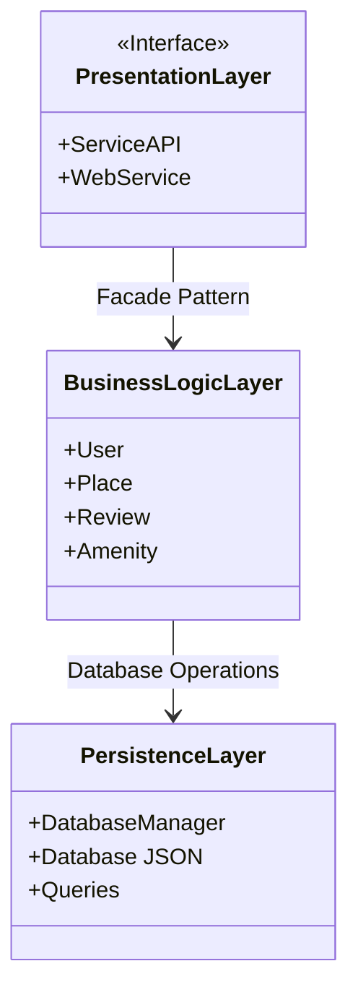
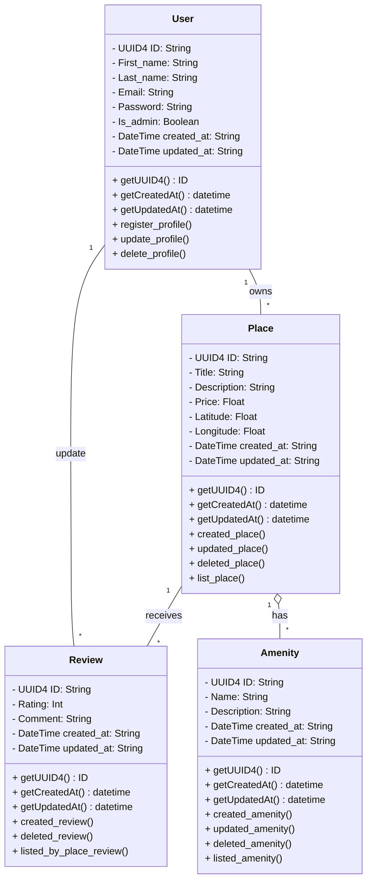
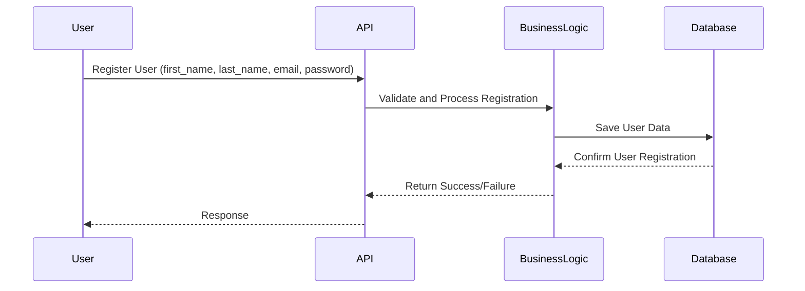
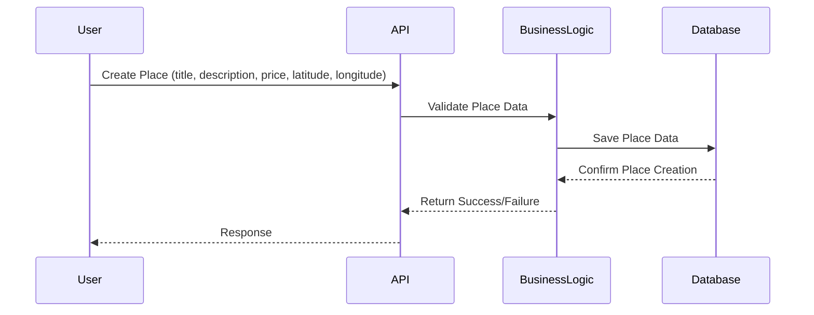
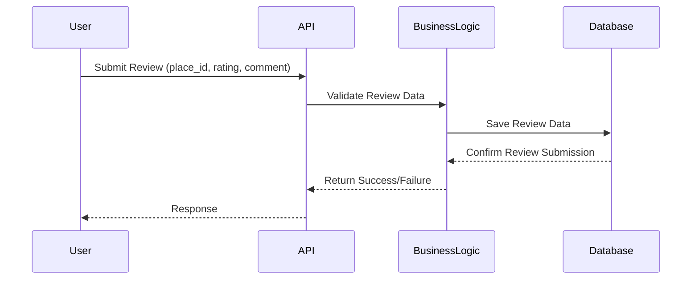
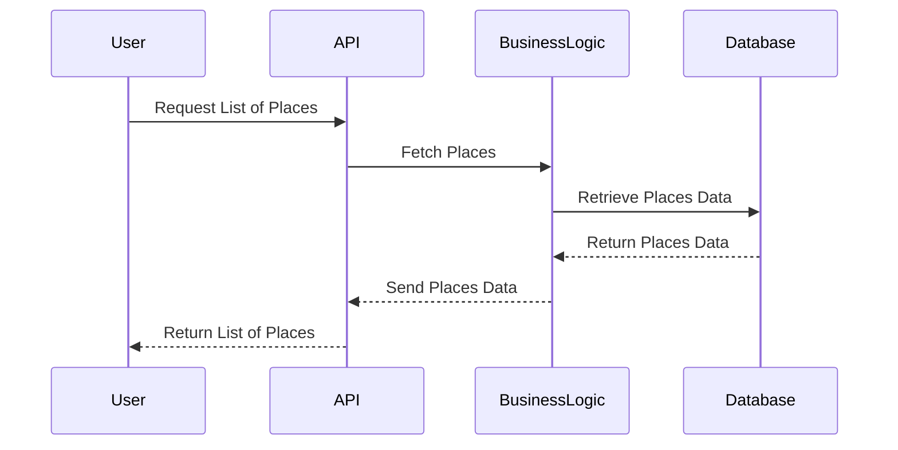

# HBnB Evolution Technical Documentation

Table of Contents
1) Introduction
2) High-Level Architecture
3) Business Logic Layer
4) API Interaction Flow
5) Conclusion

## 1) Introduction
### Overview of the Project
HBnB Evolution is a simplified version of an AirBnB-like application designed to facilitate user interactions around property listings, user reviews, and amenities. This document serves as a foundation for understanding the architecture, business logic, and API interactions within the application.

### Purpose of the Document
The purpose of this document is to provide a clear and detailed reference that outlines the application's structure, the relationships between various components, and the flow of information through the system. This will serve as a guide for the implementation phases of the HBnB Evolution application.

## 2) High-Level Architecture
### High-Level Package Diagram
The following diagram illustrates the three-layer architecture of the HBnB Evolution application. It demonstrates the interaction between the Presentation Layer, Business Logic Layer, and Persistence Layer using the facade pattern.

Explanatory Notes:
Presentation Layer: This layer encompasses all services and API endpoints that interact with users, facilitating user registration, property management, and review submissions.
Business Logic Layer: It includes the core models representing the entities (User, Place, Review, Amenity) and their respective business logic.
Persistence Layer: Responsible for data storage and retrieval, this layer interacts directly with the database to perform CRUD operations.
Facade Pattern: The facade pattern simplifies communication between the layers by providing a unified interface through which the Presentation Layer interacts with the Business Logic Layer.

## 3) Business Logic Layer
### Detailed Class Diagram
The following diagram outlines the classes within the Business Logic layer, detailing the attributes, methods, and relationships between the User, Place, Review, and Amenity entities.

Explanatory Notes:
User: Represents the application user with attributes for identification and methods for registration, updating profiles, and deletion.
Place: Represents a property listing, including methods for creation, updating, and listing of properties.
Review: Allows users to submit reviews for places they have visited, associated with both a user and a place.
Amenity: Represents amenities that can be associated with places, including methods for managing amenities.
Relationships:
A user can own multiple places (1 to many).
A place can have multiple reviews and amenities (1 to many).

## 4) API Interaction Flow
### Sequence Diagrams for API Calls
The following sequence diagrams depict the flow of interactions for four different API calls, illustrating how information moves between the layers.

#### 1. User Registration

#### 2. Place Creation

#### 3. Review Submission

#### 4. Fetching a List of Places

Explanatory Notes:
Each sequence diagram illustrates the step-by-step interactions for specific API calls.
The flow shows how data is validated, processed, and stored, as well as how responses are generated and sent back to the user.

## 5) Conclusion
This technical documentation provides a foundational understanding of the HBnB Evolution application's architecture, business logic, and API interactions. The diagrams and explanations included serve as a comprehensive reference for the implementation phases, ensuring that all stakeholders have a clear vision of the system's design and functionality.
