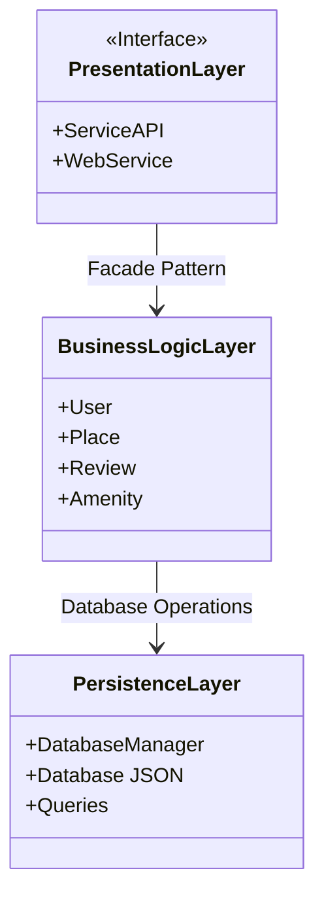
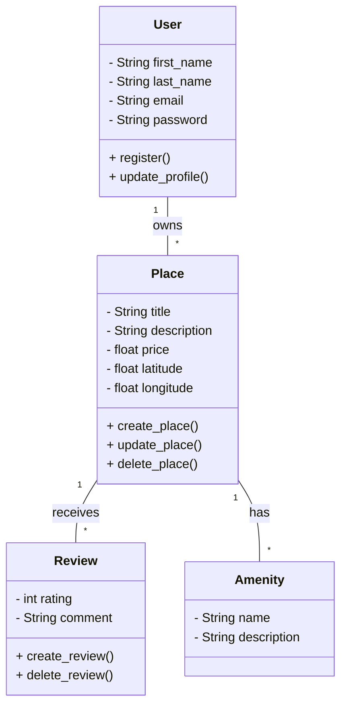
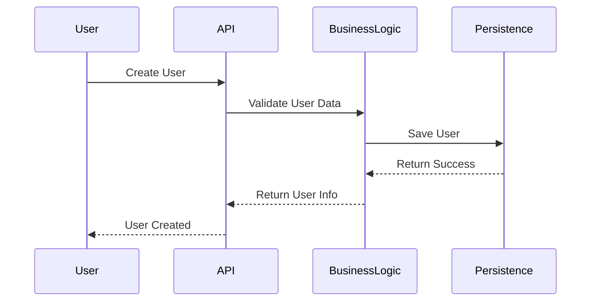
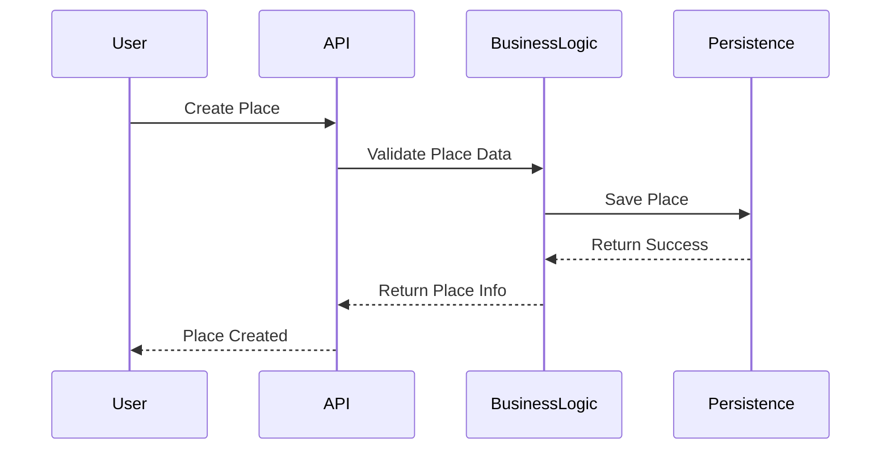
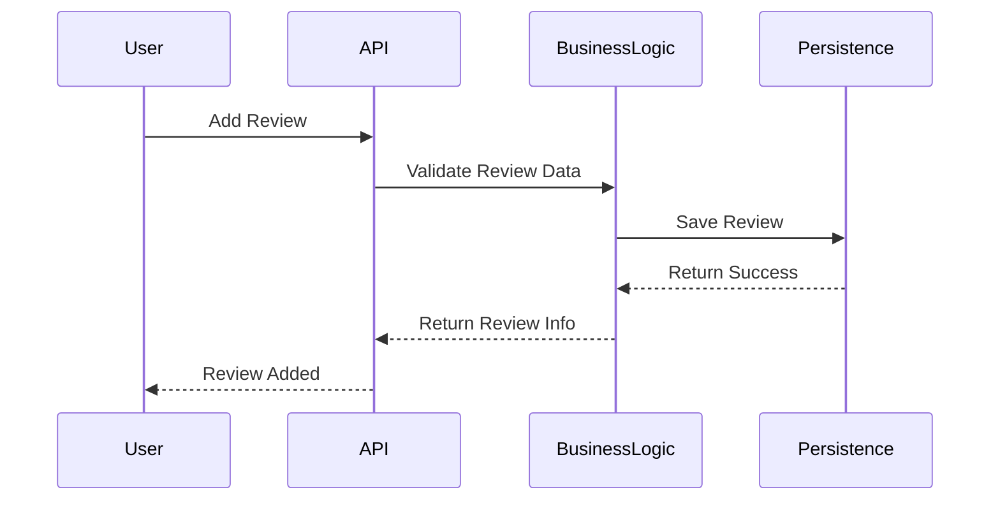
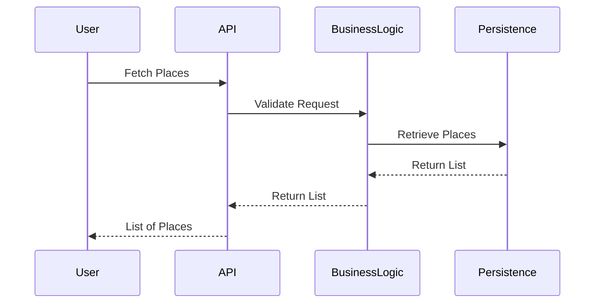

#Package Diagram



#Class Diagram


#correction Class Diagram
```mermaid
classDiagram
    class User {
        - string UUID4 id
        - String first_name
        - String last_name
        - String email
        - String password
        - boolean is_admin
        - String DateTime created_at
        - String DateTime updated_at
        + getUUID4(): ID
        + getCreatedAt(): datetime
        + getUpdatedAt(): datetime
        + register_profile()
        + update_profile()
		+delete_profile()
    }

    class Place {
        - String UUID4 id
        - String title
        - String description
        - float price
        - float latitude
        - float longitude
        - String DateTime created_at
        - String DateTime updated_at
        + getUUID4(): ID
        + getCreatedAt(): datetime
        + getUpdatedAt(): datetime
        + create_place()
        + update_place()
        + delete_place()
    }

    class Review {
        - String UUID4 id
        - int rating
        - String comment
        - String DateTime created_at
        - String DateTime updated_at
        + getUUID4(): ID
        + getCreatedAt(): datetime
        + getUpdatedAt(): datetime
        + create_review()
        + delete_review()
    }

    class Amenity {
        - String UUID4 id
        - String name
        - String description
        - String DateTime created_at
        - String DateTime updated_at
        + getUUID4(): ID
        + getCreatedAt(): datetime
        + getUpdatedAt(): datetime
    }

    User "1" -- "*" Place : owns
    User "1" -- "*" review : update
    Place "1" -- "*" Review : receives
    Place "1" -- "*" Amenity : has
    Place->>Amenity: addAmenity(name, description)
    Note over Place: Place can have multiple Amenities
```


#Sequence Diagram
##1. User Registration Sequence Diagram


##2. Place Creation Sequence Diagram

##3. Review Submission Sequence Diagram

##4. Fetching a List of Places Sequence Diagram

