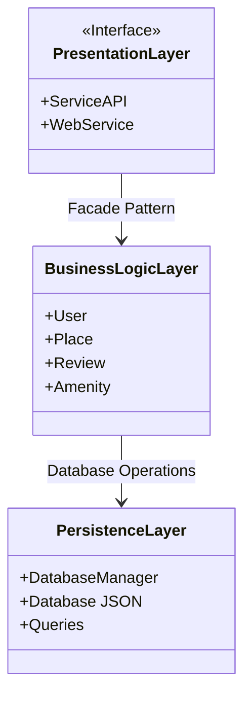
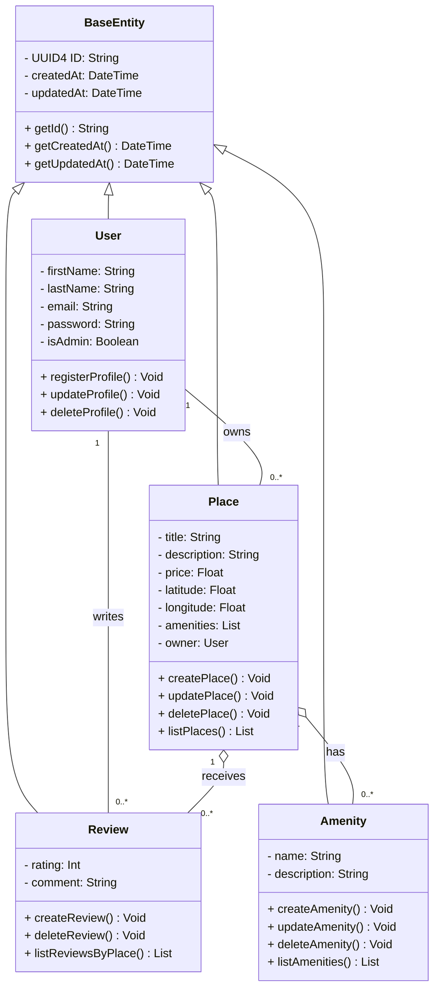
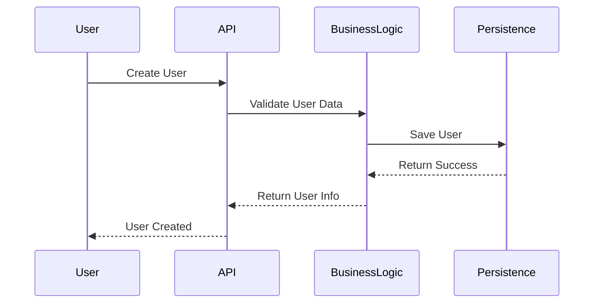
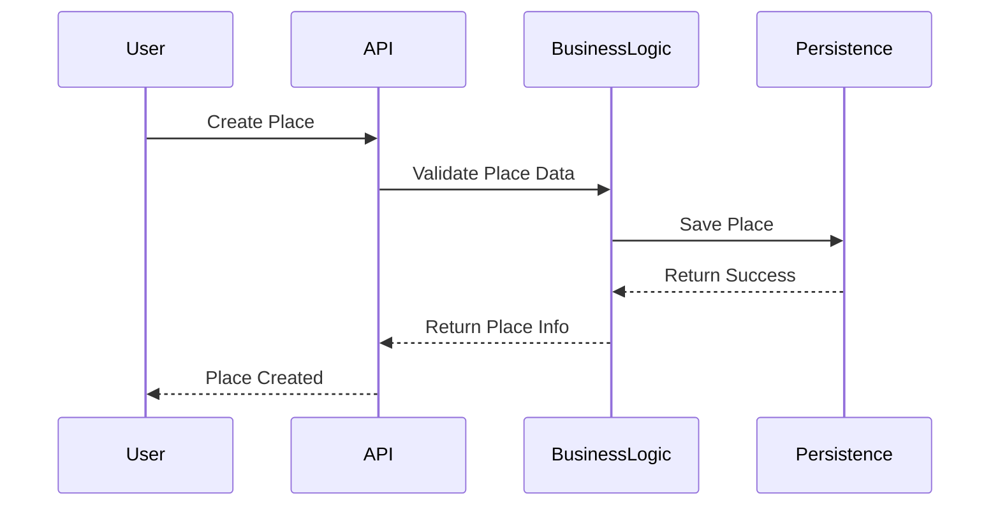
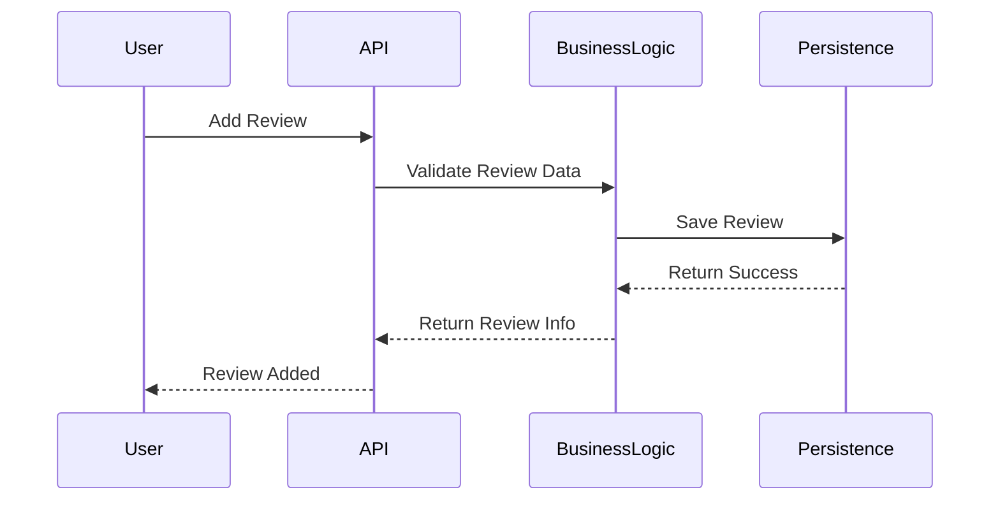
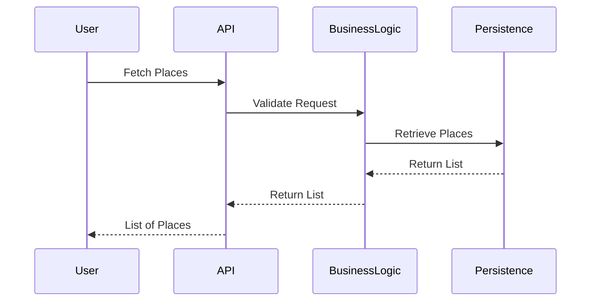

# Task0: Package Diagram

# Task1: Class Diagram

# Task2: Sequence Diagrams
## 1. User Registration Sequence Diagram

## 2. Place Creation Sequence Diagram

## 3. Review Submission Sequence Diagram

## 4. Fetching a List of Places Sequence Diagram

