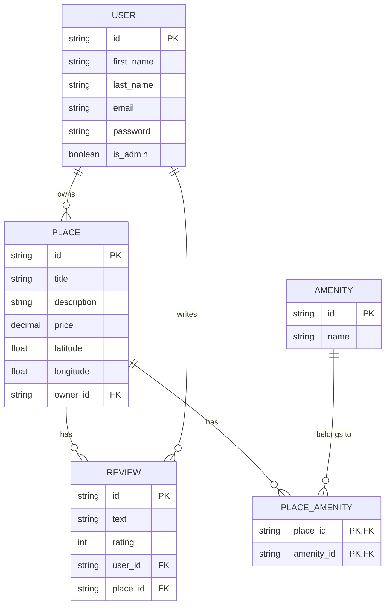

# Task 10. Generate Database Diagrams
## Entity-Relationship Diagram for HBnB




https://mermaid.live/edit/erDiagram

````plaintext
erDiagram
    USER {
        string id PK
        string first_name
        string last_name
        string email
        string password
        boolean is_admin
    }
    PLACE {
        string id PK
        string title
        string description
        decimal price
        float latitude
        float longitude
        string owner_id FK
    }
    REVIEW {
        string id PK
        string text
        int rating
        string user_id FK
        string place_id FK
    }
    AMENITY {
        string id PK
        string name
    }
    PLACE_AMENITY {
        string place_id PK, FK
        string amenity_id PK, FK
    }

    %% Relationships
    USER ||--o{ PLACE : "owns"
    PLACE ||--o{ REVIEW : "has"
    USER ||--o{ REVIEW : "writes"
    %% USER ||--|| REVIEW : "writes"
    PLACE ||--o{ PLACE_AMENITY : "has"
    AMENITY ||--o{ PLACE_AMENITY : "belongs to"
```
