# Part4
https://hbnb.alwaysdata.net/

python3 -m http.server 5500

## Login.html
email: user@hbnb.com   --> identification backend (developpment.db)

password: user1234

email: admin@hbnb.io   --> identification backend (developpment.db)

password: admin1234

email: admin@hbnb.com   --> identification frontend

password: admin1234

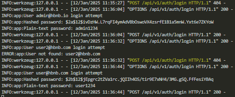

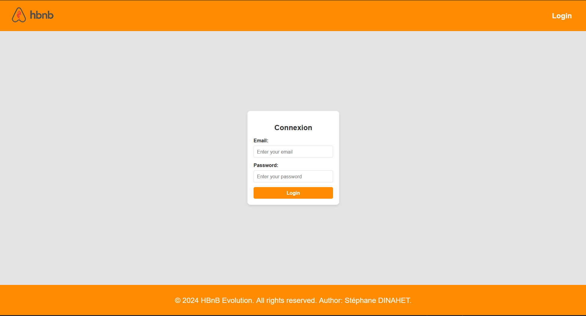

### new page login
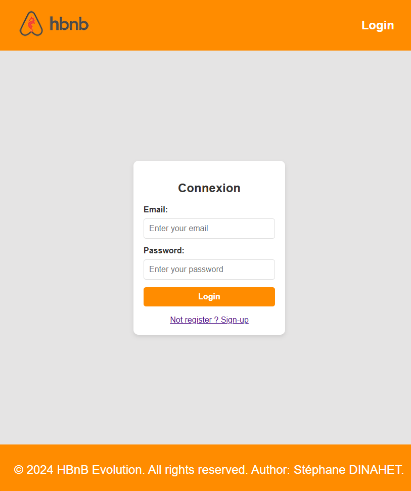

#### register a new user (in progress to resolve bug)
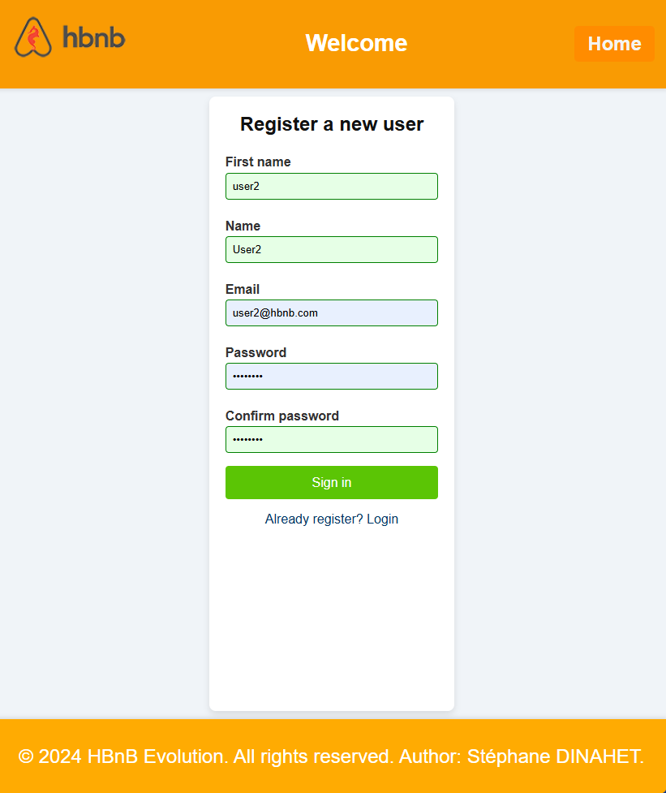
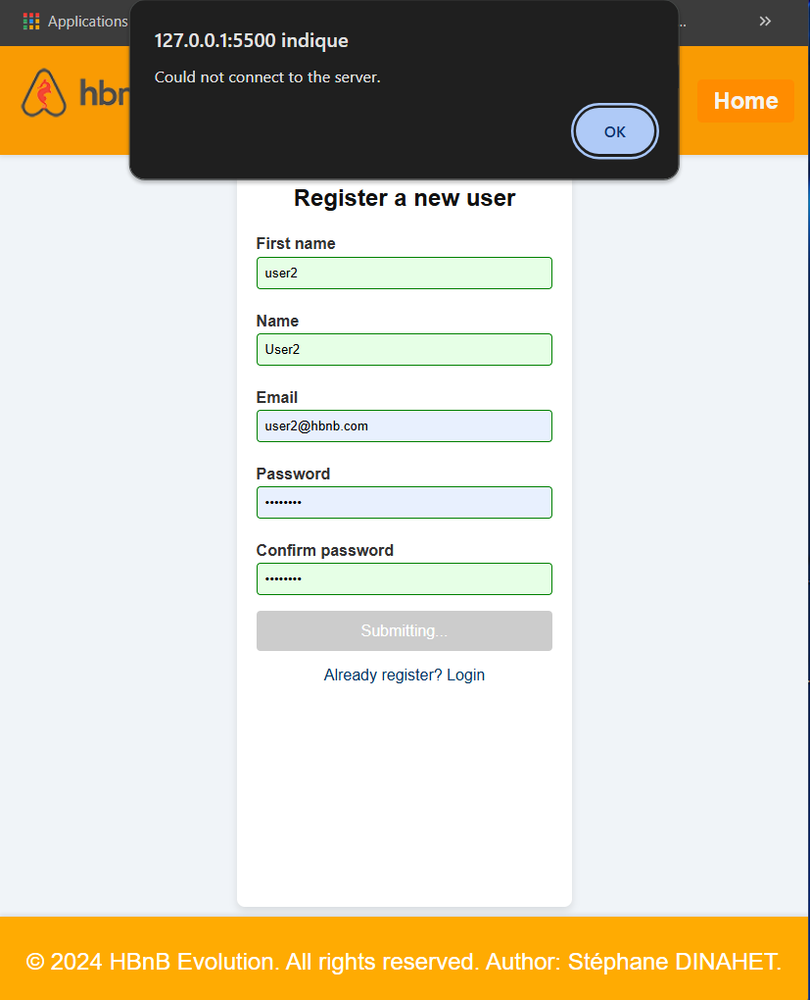
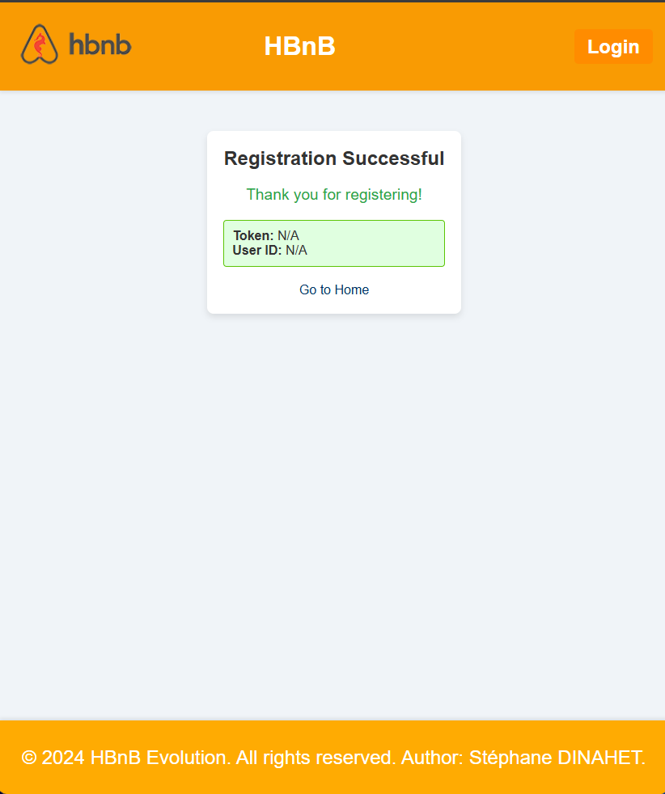

### success login

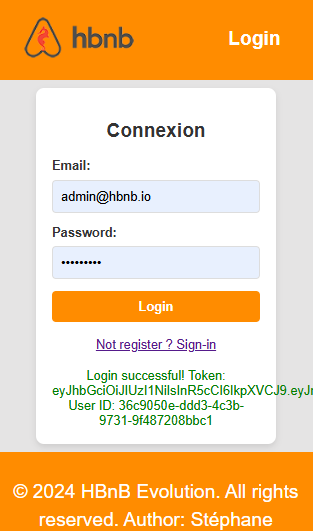
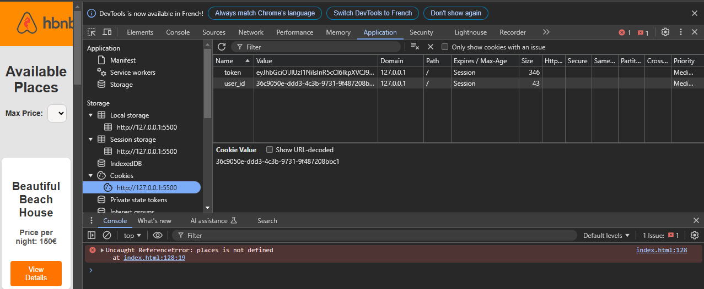

### invalid login
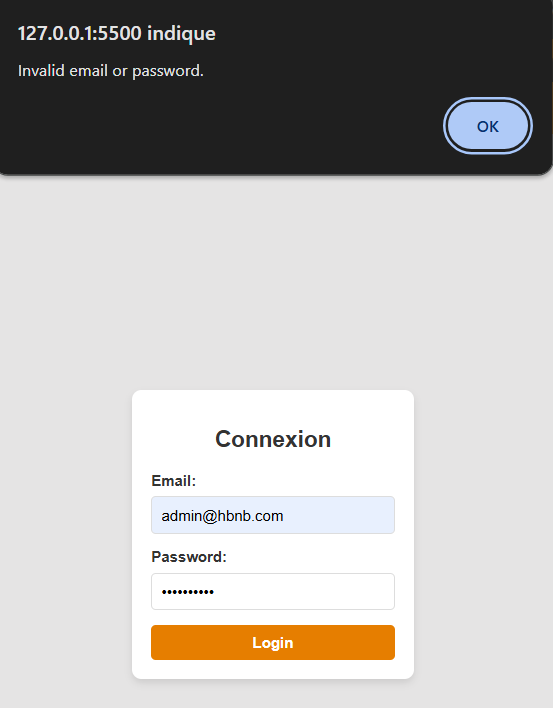

## index.html
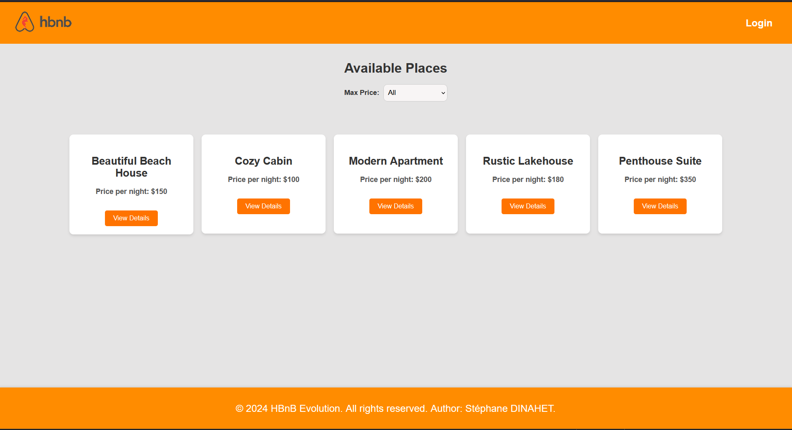

### filtre max-price
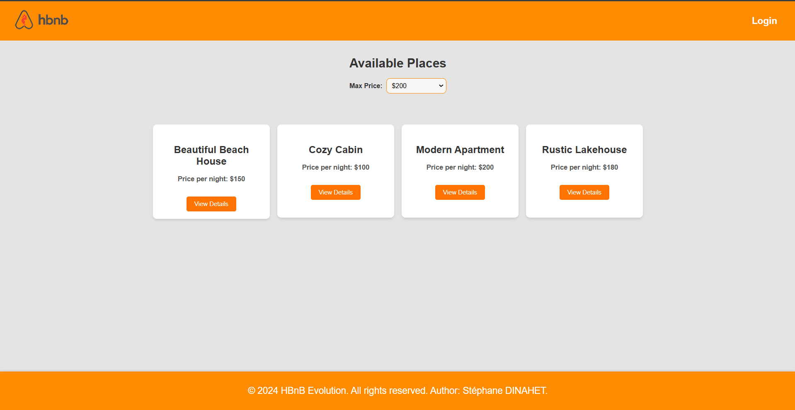

## place.html

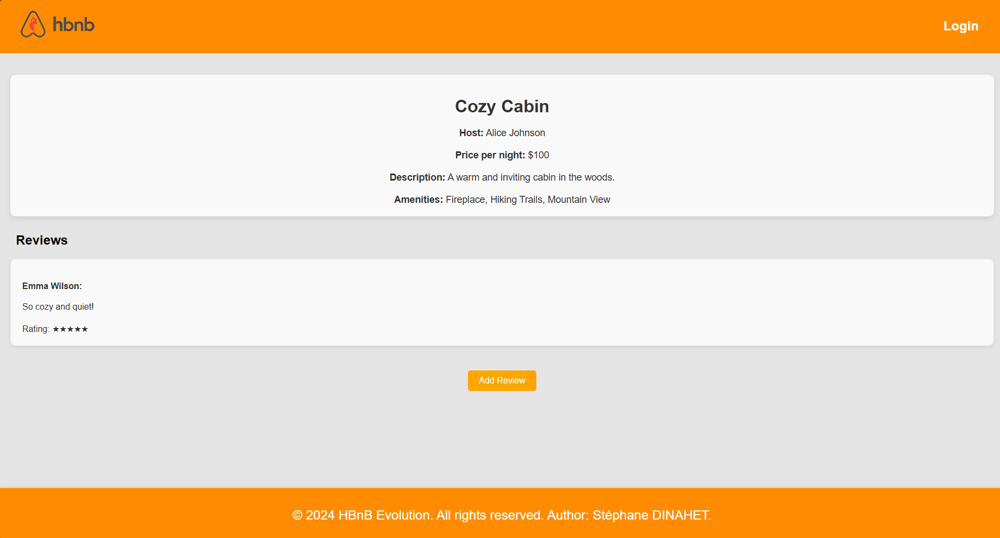

## add-review
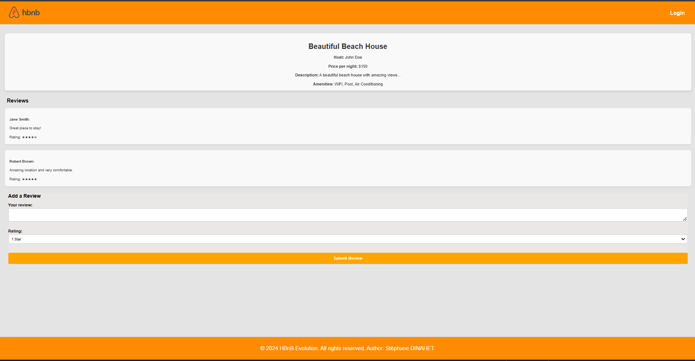
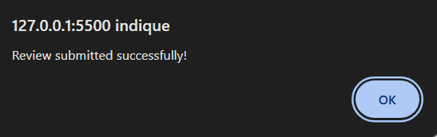

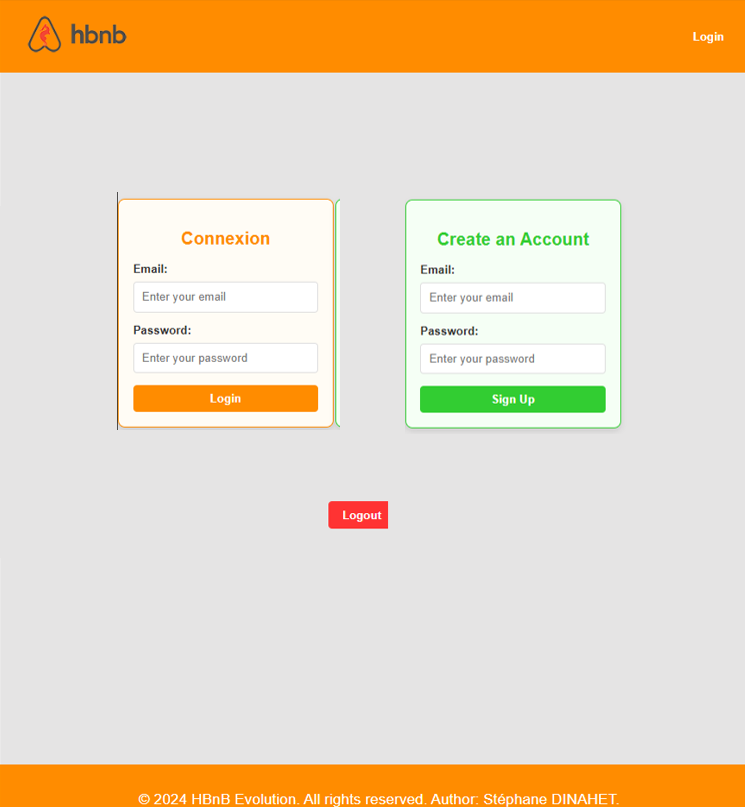

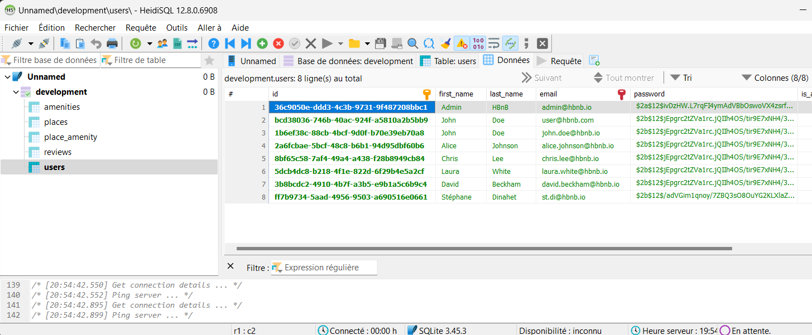

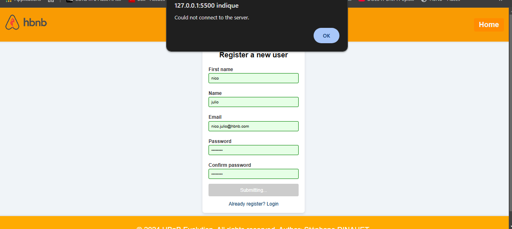

curl -X 'POST' \
  'http://127.0.0.1:5000/api/v1/users/users/' \
  -H 'accept: application/json' \
  -H 'Content-Type: application/json' \
  -d '{
  "first_name": "Stéphane",
  "last_name": "Dinahet",
  "email": "st.di@hbnb.io",
  "password": "user1234",
  "is_admin": false
}'

Voici une analyse des éventuels problèmes et des points à vérifier dans la partie 4 - Simple Web Client du projet HBnB :

🔍 Problèmes et points d'attention
1️⃣ Design (Task 1)
📂 Organisation des fichiers

Vérifiez que les fichiers HTML et CSS fournis sont bien placés et respectent la structure demandée.
Assurez-vous que toutes les classes CSS (ex: .place-card, .details-button, .review-card) sont bien utilisées et définies.
Le fichier logo.png est-il bien disponible et correctement affiché ?
Vérifiez la présence d'un footer sur chaque page.
💡 Validation HTML/CSS

Testez votre HTML et CSS avec le W3C Validator.
Vérifiez la cohérence entre la structure HTML et les styles CSS.
2️⃣ Login (Task 2)
📝 Vérification des scripts

Vérifiez que le formulaire a un event listener pour soumettre les données de connexion (scripts.js).
Utilisez preventDefault() pour éviter le rechargement intempestif de la page.
🔑 Authentification et JWT

Le token JWT est-il correctement stocké dans un cookie après la connexion ?
Utilisez document.cookie = "token=XXX; path=/"; pour le stocker.
🚦 Gestion des erreurs

Que se passe-t-il en cas d’échec de connexion ? Un message d'erreur est-il affiché à l'utilisateur ?
Vérifiez que les données envoyées au backend sont bien sous JSON (Content-Type: application/json).
3️⃣ Index - Liste des Places (Task 3)
🌍 Chargement des données

Vérifiez que l'API renvoie bien la liste des places.
Assurez-vous que chaque place est affichée sous forme de "carte" avec un bouton "View Details".
🛑 Authentification

Si l'utilisateur n'est pas connecté, la page doit rediriger vers login.html.
Si l'utilisateur est connecté, la liste des places doit s'afficher.
📌 Filtrage

Le filtre par prix fonctionne-t-il correctement sans rafraîchir la page ?
Vérifiez que l'événement change est bien ajouté au menu déroulant.
4️⃣ Place Details - Détails d’un Lieu (Task 4)
📌 Récupération des détails

Le script extrait-il bien l'ID de l'URL via window.location.search ?
L’ID est-il bien envoyé à l'API pour récupérer les détails du lieu ?
🔓 Accès au formulaire de review

Si l’utilisateur n’est pas authentifié, le formulaire d’ajout de review doit être caché.
Vérifiez que l’affichage des reviews existantes fonctionne.
5️⃣ Add Review Form (Task 5)
🔒 Gestion des accès

Si l’utilisateur n’est pas connecté, rediriger vers index.html.
📝 Envoi des reviews

Les données sont-elles bien envoyées en JSON (Content-Type: application/json) ?
Vérifiez que le place ID et le texte de la review sont bien inclus.
📢 Gestion des retours

Un message de confirmation s’affiche-t-il après une soumission réussie ?
Une erreur est-elle affichée en cas d’échec ?
✅ Actions à entreprendre
Tester chaque fonctionnalité

Connexion
Affichage des places
Filtrage
Affichage des détails
Ajout de review
Vérifier la console du navigateur (F12 > Console)

Recherchez des erreurs JavaScript (Uncaught ReferenceError, SyntaxError, etc.).
Vérifiez que toutes les requêtes API fonctionnent (Network > Fetch/XHR dans les DevTools).
Autoriser CORS sur l’API

Ajoutez CORS(app) dans votre code Flask si vous avez une erreur CORS.
Vérifier la validation HTML/CSS

Utilisez le W3C Validator.
