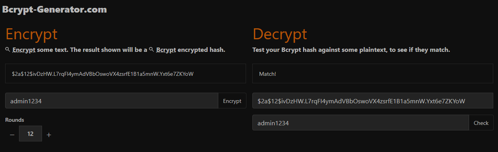
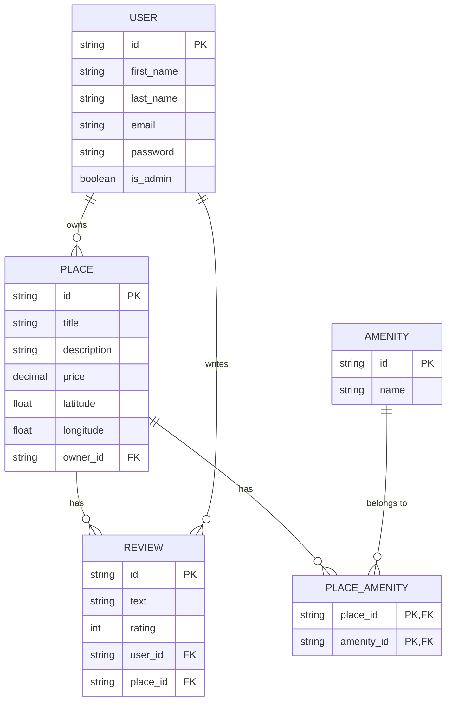
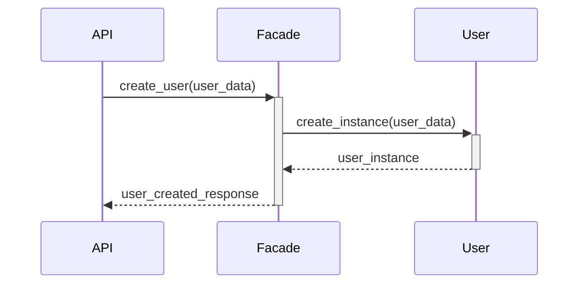

```plaintext
██╗  ██╗██████╗ ███╗   ██╗██████╗     ██╗  ██╗██████╗ ███╗   ██╗██████╗     ██╗  ██╗██████╗ ███╗   ██╗██████╗     ██╗  ██╗██████╗ ███╗   ██╗██████╗
██║  ██║██╔══██╗████╗  ██║██╔══██╗    ██║  ██║██╔══██╗████╗  ██║██╔══██╗    ██║  ██║██╔══██╗████╗  ██║██╔══██╗    ██║  ██║██╔══██╗████╗  ██║██╔══██╗
███████║███████║██╔██╗ ██║███████║    ███████║███████║██╔██╗ ██║███████║    ███████║███████║██╔██╗ ██║███████║    ███████║███████║██╔██╗ ██║███████║
██╔══██║██║  ██║██║╚██╗██║██║  ██║    ██╔══██║██║  ██║██║╚██╗██║██║  ██║    ██╔══██║██║  ██║██║╚██╗██║██║  ██║    ██╔══██║██║  ██║██║╚██╗██║██║  ██║
██║  ██║██████╔╝██║ ╚████║██████╔╝    ██║  ██║██████╔╝██║ ╚████║██████╔╝    ██║  ██║██████╔╝██║ ╚████║██████╔╝    ██║  ██║██████╔╝██║ ╚████║██████╔╝
╚═╝  ╚═╝╚═════╝ ╚═╝  ╚═══╝╚═════╝     ╚═╝  ╚═╝╚═════╝ ╚═╝  ╚═══╝╚═════╝     ╚═╝  ╚═╝╚═════╝ ╚═╝  ╚═══╝╚═════╝     ╚═╝  ╚═╝╚═════╝ ╚═╝  ╚═══╝╚═════╝
 | HBnB Part3 Logo  # C24              | HBnB Part3 Logo  # C24              | HBnB Part3 Logo  # C24              | HBnB Part3 Logo  # C24
```
[](https://github.com/SDINAHET/Part3_HBnB_Auth_&_DB/actions/workflows/test.yml)


# HBnB Application - Part 3: Enhanced Backend with Authentication and Database Integration

Arborescence du projet HBnB
```plaintext
HBnB/
├── Part3_HBnB_Auth_&_DB/
│   ├── hbnb/
│   │   ├── app/
│   │   │   ├── api/
│   │   │   │   ├── __init__.py
│   │   │   │   ├── v1/
│   │   │   │   │   ├── __init__.py
│   │   │   │   │   ├── auth.py
│   │   │   │   │   ├── users.py
│   │   │   │   │   ├── places.py
│   │   │   │   │   ├── reviews.py
│   │   │   │   │   ├── amenities.py
│   │   │   │   │   ├── protected.py
│   │   │   ├── models/
│   │   │   │   ├── __init__.py
│   │   │   │   ├── base_entity.py
│   │   │   │   ├── user.py
│   │   │   │   ├── place.py
│   │   │   │   ├── review.py
│   │   │   │   ├── amenity.py
│   │   │   │   ├── place_amenity.py
│   │   │   ├── persistence/
│   │   │   │   ├── __init__.py
│   │   │   │   ├── repository.py
│   │   │   ├── services/
│   │   │   │   ├── __init__.py
│   │   │   │   ├── facade.py
│   │   │   ├── tests/
│   ├── instance/
│   │   ├── development.db
│   │   ├── config.py
│   ├── config.py
│   ├── run.py
│   ├── requirements.txt
│   ├── __init__.py
```

## HBnB Backend API

### Overview
This repository contains the backend API for the HBnB application. The API is built using Flask and SQLAlchemy and provides endpoints for managing users, places, reviews, and amenities.

### Installation
#### Prerequisites:

Python (version 3.10)
pip (Python package installer)
A code editor (Visual Studio Code)

#### Clone the repository:

```Bash
git clone https://github.com/SDINAHET/HBnB.git
cd HBnB/Part3_HBnB_AUTH_&_DB/hbnb
```

#### Create a virtual environment:

```Bash
python -m venv venv
source venv/bin/activate  # For Linux/macOS
venv\Scripts\activate  # For Windows
```

#### Install dependencies:

```Bash
pip install -r requirements.txt
```

```plaintext
Flask==2.1.3
flask-restx==0.5.1
marshmallow==3.18.0
requests==2.31.0
flask-bcrypt==1.0.1
flask-jwt-extended==4.4.4
pytest==7.3.1
sqlalchemy==1.4.47
flask-sqlalchemy==2.5.1
Werkzeug==2.1.2
pytest==7.3.1
pytest-flask
pytest-cov
```
#### run hbnb:

```Bash
cd hbnb
./run.py
```


#### Create the database:

```Bash
flask shell
from app import db
db.create_all()
```

#### Configuration
Environment variables:
Set the FLASK_APP environment variable to app:app.
Set the FLASK_ENV environment variable to development or production to enable debug mode.
Database configuration:
Update the SQLALCHEMY_DATABASE_URI setting in your configuration file (e.g., config.py) to match your database connection details.

#### Running the application
```Bash
flask run
```

### SQLITE
in hbnb folder
```bash
sqlite3 development.db
```

then insert the script: 1_activate_foreign_key
```sql
-- Activer les clés étrangères
PRAGMA foreign_keys = ON;
```
and script: 2_create_tables.sql
```sql
-- Create User table
CREATE TABLE users (
    id CHAR(36) PRIMARY KEY,
    first_name VARCHAR(255),
    last_name VARCHAR(255),
    email VARCHAR(255) UNIQUE NOT NULL,
    password VARCHAR(255) NOT NULL,
    is_admin BOOLEAN DEFAULT FALSE,
    created_at DATETIME DEFAULT CURRENT_TIMESTAMP,
    updated_at DATETIME DEFAULT CURRENT_TIMESTAMP
);

-- Create Place table
CREATE TABLE places (
    id CHAR(36) PRIMARY KEY,
    title VARCHAR(255) NOT NULL,
    description TEXT,
    price DECIMAL(10, 2) NOT NULL,
    latitude FLOAT NOT NULL,
    longitude FLOAT NOT NULL,
    owner_id CHAR(36),
    created_at DATETIME DEFAULT CURRENT_TIMESTAMP,
    updated_at DATETIME DEFAULT CURRENT_TIMESTAMP,
    FOREIGN KEY (owner_id) REFERENCES users(id) ON DELETE CASCADE
);

-- Create Review table
CREATE TABLE reviews (
    id CHAR(36) PRIMARY KEY,
    text TEXT NOT NULL,
    rating INT CHECK (rating BETWEEN 1 AND 5),
    user_id CHAR(36),
    place_id CHAR(36),
    created_at DATETIME DEFAULT CURRENT_TIMESTAMP,
    updated_at DATETIME DEFAULT CURRENT_TIMESTAMP,
    FOREIGN KEY (user_id) REFERENCES users(id) ON DELETE CASCADE,
    FOREIGN KEY (place_id) REFERENCES places(id) ON DELETE CASCADE,
    UNIQUE (user_id, place_id)
);

-- Create Amenity table
CREATE TABLE amenities (
    id CHAR(36) PRIMARY KEY,
    name VARCHAR(255) UNIQUE NOT NULL,
    created_at DATETIME DEFAULT CURRENT_TIMESTAMP,
    updated_at DATETIME DEFAULT CURRENT_TIMESTAMP

);

-- Create Place_Amenity association table
CREATE TABLE place_amenity (
    place_id CHAR(36),
    amenity_id CHAR(36),
    PRIMARY KEY (place_id, amenity_id),
    FOREIGN KEY (place_id) REFERENCES places(id) ON DELETE CASCADE,
    FOREIGN KEY (amenity_id) REFERENCES amenities(id) ON DELETE CASCADE
);
```
and then script: 3_insert_initial_data_admin.sql
```sql
-- Insert admin user
INSERT INTO users (id, first_name, last_name, email, password, is_admin)
VALUES (
    '36c9050e-ddd3-4c3b-9731-9f487208bbc1', -- fix const UUID prédéfini
    'Admin',
    'HBnB',
    'admin@hbnb.io',
    ---'hashed_admin1234',  -- Replace with the hashed password
    -- '$2b$12$WZqhkmHErIMTl7YKJ/RdfXEbrNKg9XyFo7Csh5RgN5tQ8qGHyjfD2', -- bcrypt hash of 'admin1234'
    '$2a$12$ivDzHW.L7rqFI4ymAdVBbOswoVX4zsrfE1B1a5mnW.Yxt6e7ZKYoW', -- bcrypt2 hash of 'admin1234'
    TRUE
);

INSERT INTO amenities (id, name) VALUES ('a12ef460-8e90-4e7a-8f43-1918a006078d', 'WiFi');
INSERT INTO amenities (id, name) VALUES ('acbc951d-ef60-4486-84b9-87afc47d1eb2', 'Swimming Pool');
INSERT INTO amenities (id, name) VALUES ('6fac204d-90b6-40cc-a87a-dbbc0814745e', 'Air Conditioning');
```
checking hash password: https://bcrypt-generator.com/


### ADMINISTRATOR:

```plaintext
Admin
HBnB
email: admin@hbnb.io
password: admin1234
hashed password: $2b$12$WZqhkmHErIMTl7YKJ/RdfXEbrNKg9XyFo7Csh5RgN5tQ8qGHyjfD2
$2a$12$ivDzHW.L7rqFI4ymAdVBbOswoVX4zsrfE1B1a5mnW.Yxt6e7ZKYoW
UUID4_user:36c9050e-ddd3-4c3b-9731-9f487208bbc1  (fix always)


Amenity1:
UUID4_amenity: a12ef460-8e90-4e7a-8f43-1918a006078d
name: WiFi

Amenity2:
UUID4_amenity: acbc951d-ef60-4486-84b9-87afc47d1eb2
name: Swimming Pool

Amenity3:
UUID4_amenity: 6fac204d-90b6-40cc-a87a-dbbc0814745e
name: Air Conditioning
```

### API Endpoints
User Endpoints
Create a user:
```Bash
curl -X POST http://127.0.0.1:5000/api/v1/users/ -H "Content-Type: application/json" -d '{"first_name": "John", "last_name": "Doe", "email": "johndoe@example.com", "password": "password123"}'
```

Get a user:
```Bash
curl http://127.0.0.1:5000/api/v1/users/<user_id>
```

Update a user:
```Bash
curl -X PUT http://127.0.0.1:5000/api/v1/users/<user_id> -H "Content-Type: application/json" -d '{"first_name": "Jane"}'
```

Place Endpoints
Create a place:
```Bash
# ... (similar to creating a user)
```

Get a place:
```Bash
# ... (similar to getting a user)
```

Get places with amenities:
```Bash
curl http://127.0.0.1:5000/api/v1/places?amenity=wifi&amenity=pool
```

Review Endpoints
Create a review:
```Bash
# ... (similar to creating a user)
```

Get reviews for a place:
```Bash
curl http://127.0.0.1:5000/api/v1/places/<place_id>/reviews
```

Amenity Endpoints
Get all amenities:
```Bash
curl http://127.0.0.1:5000/api/v1/amenities
```

#### Database Schema
<!-- [Insert Mermaid.js diagram here] -->
<!-- Part3_HBnB_Auth_&_DB/hbnb/app/ER_diagrams.png -->


#### Technologies Used
Python: Programming language
Flask: Web framework
SQLAlchemy: ORM for database interactions
SQLite: Database (can be replaced with PostgreSQL, MySQL, etc.)
Mermaid.js: For generating database diagrams

#### Contributing (Dinahet Stéphane / Beaumois Louis / Henri Mille)
Fork the repository
Create a new branch
Make your changes
Commit and push
Submit a pull request

#### License
[MIT]

________________________________________________________________________________

# HBnB Application - Part 2: Implementation of Business Logic and API Endpoints

## Overview

In Part 2 of the HBnB Project, the focus shifts to the **Implementation Phase**. This phase involves building the **Presentation** and **Business Logic** layers of the application using Python and Flask. The core functionality is brought to life by defining the necessary classes, methods, and API endpoints that form the foundation of the HBnB application.

**Note:** At this stage, user authentication and role-based access control are not implemented. These features will be addressed in the subsequent part of the project.

## Table of Contents

- [Objectives](#objectives)
- [Project Vision and Scope](#project-vision-and-scope)
- [Learning Objectives](#learning-objectives)
- [Project Setup and Package Initialization](#project-setup-and-package-initialization)
- [Implement Core Business Logic Classes](#implement-core-business-logic-classes)
- [Implement API Endpoints](#implement-api-endpoints)
  - [User Endpoints](#user-endpoints)
  - [Amenity Endpoints](#amenity-endpoints)
  - [Place Endpoints](#place-endpoints)
  - [Review Endpoints](#review-endpoints)
- [Testing and Validation](#testing-and-validation)
- [Resources](#resources)
- [Repository Information](#repository-information)
- [Contributors](#contributors)

## Objectives

This is objectives of this project:

1. **Set Up the Project Structure:**
   - Organize the project into a modular architecture following best practices for Python and Flask applications.
   - Create necessary packages for the Presentation and Business Logic layers.

2. **Implement the Business Logic Layer:**
   - Develop core classes for business logic, including `User`, `Place`, `Review`, and `Amenity` entities.
   - Implement relationships between entities and define their interactions.
   - Utilize the Facade pattern to simplify communication between the Presentation and Business Logic layers.

3. **Build RESTful API Endpoints:**
   - Implement CRUD operations for Users, Places, Reviews, and Amenities.
   - Use `flask-restx` to define and document the API, ensuring a clear and consistent structure.
   - Implement data serialization to return extended attributes for related objects (e.g., owner details and amenities when retrieving a Place).

4. **Test and Validate the API:**
   - Ensure that each endpoint works correctly and handles edge cases appropriately.
   - Use tools like Postman or cURL to test API endpoints.
   - Create a detailed testing report highlighting both successful and failed cases.

## Project Vision and Scope

The implementation phase focuses on creating a functional and scalable foundation for the HBnB application by developing:

- **Presentation Layer:** Defining services and API endpoints using Flask and `flask-restx`. Endpoints are structured logically, ensuring clear paths and parameters for each operation.

- **Business Logic Layer:** Building core models and logic that drive the application’s functionality, including defining relationships, handling data validation, and managing interactions between different components.

**Note:** User authentication and access control will be integrated in Part 3.

## Learning Objectives

This part of the project is designed to help you achieve the following learning outcomes:

- **Modular Design and Architecture:** Learn how to structure a Python application using best practices for modularity and separation of concerns.

- **API Development with Flask and flask-restx:** Gain hands-on experience in building RESTful APIs using Flask, focusing on creating well-documented and scalable endpoints.

- **Business Logic Implementation:** Understand how to translate documented designs into working code, implementing core business logic in a structured and maintainable manner.

- **Data Serialization and Composition Handling:** Practice returning extended attributes in API responses, handling nested and related data efficiently.

- **Testing and Debugging:** Develop skills in testing and validating APIs to ensure that endpoints handle requests correctly and return appropriate responses.

## Project Setup and Package Initialization

### 1. Project Directory Structure

Organize the project into a modular architecture with clear separation of concerns:

```text
    hbnb/
    ├── app/
    │   ├── __init__.py
    │   ├── api/
    │   │   ├── __init__.py
    │   │   ├── v1/
    │   │       ├── __init__.py
    │   │       ├── users.py
    │   │       ├── places.py
    │   │       ├── reviews.py
    │   │       ├── amenities.py
    │   ├── models/
    │   │   ├── __init__.py
    │   │   ├── base_entity.py
    │   │   ├── user.py
    │   │   ├── place.py
    │   │   ├── review.py
    │   │   ├── amenity.py
    │   ├── services/
    │   │   ├── __init__.py
    │   │   ├── facade.py
    │   ├── persistence/
    │   │   ├── __init__.py
    │   │   ├── repository.py
    │   │
    │   ├── tests/
    │       ├── test_ok/ ....
    ├── run.py
    ├── config.py
    ├── requirements.txt
    ├── README.md
```

### 2. Initializing Python Packages

Ensure each directory intended to be a Python package contains an `__init__.py` file. This allows Python to recognize these directories as importable packages.

For example, `hbnb/app/__init__.py`:

```python
# hbnb/app/__init__.py
```

Similarly, other __init__.py files can remain empty or include initialization code as needed.

### 3. Setting Up the Flask Application with Placeholders

Initialize the Flask application within app/__init__.py at the start....

```python
# hbnb/app/__init__.py

from flask import Flask
from flask_restx import Api

def create_app(config_name=None):
    app = Flask(__name__)

    # Load configuration
    if config_name:
        from ..config import config
        app.config.from_object(config[config_name])
    else:
        from ..config import config
        app.config.from_object(config['default'])

    api = Api(
        app,
        version='1.0',
        title='HBnB API',
        description='HBnB Application API'
    )

    # Import and add API namespaces (placeholders)
    from .api.v1 import users, places, reviews, amenities
    api.add_namespace(users.api, path='/api/v1/users')
    api.add_namespace(places.api, path='/api/v1/places')
    api.add_namespace(reviews.api, path='/api/v1/reviews')
    api.add_namespace(amenities.api, path='/api/v1/amenities')

    return app
```

### 4. Implementing the In-Memory Repository

The in-memory repository handles object storage and provides an interface that can later be replaced with a database-backed solution.

app/persistence/repository.py  at the start....

```python
# hbnb/app/persistence/repository.py

from abc import ABC, abstractmethod

class Repository(ABC):
    @abstractmethod
    def add(self, obj):
        """Add an object to the repository."""
        pass

    @abstractmethod
    def get(self, obj_id):
        """Retrieve an object by its ID."""
        pass

    @abstractmethod
    def get_all(self):
        """Retrieve all objects."""
        pass

    @abstractmethod
    def update(self, obj_id, data):
        """Update an object with the provided data."""
        pass

    @abstractmethod
    def delete(self, obj_id):
        """Delete an object by its ID."""
        pass

    @abstractmethod
    def get_by_attribute(self, attr_name, attr_value):
        """Retrieve an object by a specific attribute."""
        pass


class InMemoryRepository(Repository):
    def __init__(self):
        self._storage = {}

    def add(self, obj):
        """Add an object to the repository."""
        self._storage[obj.id] = obj

    def get(self, obj_id):
        """Retrieve an object by its ID."""
        return self._storage.get(obj_id)

    def get_all(self):
        """Retrieve all objects."""
        return list(self._storage.values())

    def update(self, obj_id, data):
        """Update an object with the provided data."""
        obj = self.get(obj_id)
        if obj:
            obj.update(data)

    def delete(self, obj_id):
        """Delete an object by its ID."""
        if obj_id in self._storage:
            del self._storage[obj_id]

    def get_by_attribute(self, attr_name, attr_value):
        """Retrieve an object by a specific attribute."""
        return next((obj for obj in self._storage.values() if getattr(obj, attr_name, None) == attr_value), None)
```

### 5. Planning for the Facade Pattern

Implement the Facade pattern to simplify communication between the Presentation and Business Logic layers.
app/services/facade.py at the start....

```python
# hbnb/app/services/facade.py

from app.persistence.repository import InMemoryRepository
from app.models.user import User
from app.models.place import Place
from app.models.review import Review
from app.models.amenity import Amenity

class HBnBFacade:
    def __init__(self):
        self.user_repo = InMemoryRepository()
        self.place_repo = InMemoryRepository()
        self.review_repo = InMemoryRepository()
        self.amenity_repo = InMemoryRepository()

    # User Methods
    def create_user(self, first_name: str, last_name: str, email: str, password: str, is_admin: bool = False) -> User:
        user = User(first_name=first_name, last_name=last_name, email=email, password=password, is_admin=is_admin)
        self.user_repo.add(user)
        user.register_profile()
        return user

    def get_user(self, user_id: str) -> User:
        return self.user_repo.get(user_id)

    def get_all_users(self) -> list:
        return self.user_repo.get_all()

    def update_user(self, user_id: str, data: dict):
        self.user_repo.update(user_id, data)

    def delete_user(self, user_id: str):
        user = self.get_user(user_id)
        if user:
            # Optionally handle cascading deletes
            self.user_repo.delete(user_id)
            user.delete_profile()

    # Amenity Methods
    def create_amenity(self, name: str, description: str = "") -> Amenity:
        amenity = Amenity(name=name, description=description)
        self.amenity_repo.add(amenity)
        amenity.create_amenity()
        return amenity

    def get_amenity(self, amenity_id: str) -> Amenity:
        return self.amenity_repo.get(amenity_id)

    def get_all_amenities(self) -> list:
        return self.amenity_repo.get_all()

    def update_amenity(self, amenity_id: str, data: dict):
        self.amenity_repo.update(amenity_id, data)

    def delete_amenity(self, amenity_id: str):
        amenity = self.get_amenity(amenity_id)
        if amenity:
            self.amenity_repo.delete(amenity_id)
            amenity.delete_amenity()

    # Place Methods
    def create_place(self, title: str, description: str, price: float, latitude: float, longitude: float, owner_id: str) -> Place:
        owner = self.get_user(owner_id)
        if not owner:
            raise ValueError("Owner not found.")
        place = Place(title=title, description=description, price=price, latitude=latitude, longitude=longitude, owner=owner)
        self.place_repo.add(place)
        place.create_place()
        return place

    def get_place(self, place_id: str) -> Place:
        return self.place_repo.get(place_id)

    def get_all_places(self) -> list:
        return self.place_repo.get_all()

    def update_place(self, place_id: str, data: dict):
        self.place_repo.update(place_id, data)

    def delete_place(self, place_id: str):
        place = self.get_place(place_id)
        if place:
            self.place_repo.delete(place_id)
            place.delete_place()

    # Review Methods
    def create_review(self, text: str, rating: int, place_id: str, user_id: str) -> Review:
        place = self.get_place(place_id)
        user = self.get_user(user_id)
        if not place:
            raise ValueError("Place not found.")
        if not user:
            raise ValueError("User not found.")
        review = Review(text=text, rating=rating, place=place, user=user)
        self.review_repo.add(review)
        review.create_review()
        return review

    def get_review(self, review_id: str) -> Review:
        return self.review_repo.get(review_id)

    def get_all_reviews(self) -> list:
        return self.review_repo.get_all()

    def update_review(self, review_id: str, data: dict):
        self.review_repo.update(review_id, data)

    def delete_review(self, review_id: str):
        review = self.get_review(review_id)
        if review:
            self.review_repo.delete(review_id)
            review.delete_review()
```

# HBnB API Testing and Validation

## Validation
Each endpoint includes validation checks for attributes to ensure data integrity and prevent invalid data from being processed. Examples:

- **User Creation**: Validates that the first name and last name are provided and do not exceed 50 characters, the email follows a standard format, and the password is at least 6 characters long.
- **Place Creation**: Validates that the title is provided and does not exceed 100 characters, the price is a positive value, and the latitude and longitude are within valid ranges.

## Testing Tools
- **cURL**: Used for black-box testing to verify each endpoint’s response format and status codes.
- **Postman**: An alternative tool for testing API endpoints with a user-friendly interface.
- **Flask-RESTx Swagger Documentation**: Automatically generated documentation available at [http://localhost:5000/api/v1/](http://localhost:5000/api/v1/) to visually confirm the API structure.

## Example cURL Commands

## USER OPERATION

### Create/Post a User
```bash
curl -X POST http://localhost:5000/api/v1/users/ \
     -H "Content-Type: application/json" \
     -d '{"first_name": "John", "last_name": "Doe", "email": "john.doe@example.com"}'
```

```jsonc
Possible Status Codes Endpoint:
// `201 OK Created`: When the user is successfully created.
// `400 Bad Request`: If the email is already registered or input data is invalid.
```

### Get All Users
```bash
curl http://localhost:5000/api/v1/users/
```

```jsonc
Possible Status Codes Endpoint:
// `200 OK`: When the list of users is successfully retrieved.
```

### Get a Specific User ID
```bash
curl http://localhost:5000/api/v1/users/<user_id>
```

```jsonc
Possible Status Codes Endpoint:
// `200 OK`: When the user is successfully retrieved.
// `404 Not Found`: If the user does not exist.
```

### Update/Put a User
```bash
curl -X PUT http://localhost:5000/api/v1/users/<user_id> \
     -H "Content-Type: application/json" \
     -d '{"first_name": "Jane", "email": "jane.doe@example.com"}'
```

```jsonc
Possible Status Codes Endpoint:
// `200 OK`: When the user is successfully updated.
// `404 Not Found`: If the user does not exist.
// `400 Bad Request`: If input data is invalid.
```

## AMENITY OPERATION

### Create/Post an Amenity
```bash
curl -X POST http://localhost:5000/api/v1/amenities/ \
     -H "Content-Type: application/json" \
     -d '{"name": "Wi-Fi"}'
```

```jsonc
Possible Status Codes Endpoint:
// `201 Created`: When the amenity is successfully created.
// `400 Bad Request`: If input data is invalid.
```

### Get All Amenity
```bash
curl http://localhost:5000/api/v1/amenity/
```

```jsonc
Possible Status Codes Endpoint:
// `200 OK`: List of amenities retrieved successfully.
```

### Get a Specific Amenity ID
```bash
curl http://localhost:5000/api/v1/amenity/<amenity_id>
```

```jsonc
Possible Status Codes Endpoint:
// `200 OK`: When the amenity is successfully retrieved.
// `404 Not Found`: If the amenity does not exist.
```

### Update/Put a Amenity
```bash
curl -X PUT http://localhost:5000/api/v1/amenity/<amenity_id> \
     -H "Content-Type: application/json" \
     -d  '{"name": "Wi-Fi"}'
```

```jsonc
Possible Status Codes Endpoint:
// `200 OK`: When the amenity is successfully updated.
// `404 Not Found`: If the amenity does not exist.
// `400 Bad Request`: If input data is invalid.
```

## PLACE OPERATION

### Create/Post a Place
```bash
curl -X POST http://localhost:5000/api/v1/places/ \
     -H "Content-Type: application/json" \
     -d '{
           "title": "Cozy Apartment",
           "description": "A nice place to stay",
           "price": 100.0,
           "latitude": 37.7749,
           "longitude": -122.4194,
           "owner_id": "<user_id>",
           "amenities": ["<amenity_id1>", "<amenity_id2>"]
         }'
```

```jsonc
Possible Status Codes Endpoint:
// `201 Created`: When the place is successfully created.
// `400 Bad Request`: If input data is invalid.
```

### Get All Place
```bash
curl http://localhost:5000/api/v1/places/
```

```jsonc
Possible Status Codes Endpoint:
// `200 OK`: List of places retrieved successfully.
```

### Get a Specific Place
```bash
curl http://localhost:5000/api/v1/places/<place_id>
```

```jsonc
Possible Status Codes Endpoint:
// `200 OK`: When the place and its associated owner and amenities are successfully retrieved.
// `404 Not Found`: If the place does not exist.
```

### Update/Put a Place
```bash
curl -X PUT http://localhost:5000/api/v1/places/<place_id> \
     -H "Content-Type: application/json" \
     -d '{
           "title": "Updated Cozy Apartment",
           "description": "An updated nice place to stay",
           "price": 120.0,
           "latitude": 37.7749,
           "longitude": -122.4194
         }'
```

```jsonc
Possible Status Codes Endpoint:
// `200 OK`: When the place is successfully updated.
// `404 Not Found`: If the place does not exist.
// `400 Bad Request`: If input data is invalid.
```

## REVIEW OPERATION

### Create/Post a Review
```bash
curl -X POST http://localhost:5000/api/v1/reviews/ \
     -H "Content-Type: application/json" \
     -d '{
           "text": "Great place!",
           "rating": 5,
           "place_id": "<place_id>",
           "user_id": "<user_id>"
         }'
```

```jsonc
Possible Status Codes Endpoint:
// `201 Created`: When the review is successfully created.
// `400 Bad Request`: If input data is invalid.
```

### Get all Review
```bash
curl -X GET http://localhost:5000/api/v1/places/<place_id>/reviews
```

```jsonc
Possible Status Codes Endpoint:
// `200 OK`: List of reviews retrieved successfully.
```

### Get Review with review ID
```bash
curl -X GET http://localhost:5000/api/v1/reviews/<review_id>/
```

```jsonc
Possible Status Codes Endpoint:
// `200 OK`: When the review is successfully retrieved.
// `404 Not Found`: If the review does not exist.
```

### Get all Review with place ID
```bash
curl -X GET http://localhost:5000/api/v1/places/<place_id>/reviews
```

```jsonc
Possible Status Codes Endpoint:
// `200 OK`: List of reviews for the place retrieved successfully.
// `404 Not Found`: If the place does not exist.
```

### Update/Put a Review with review ID
```bash
curl -X PUT http://localhost:5000/api/v1/reviews/<review_id>/ \
     -H "Content-Type: application/json" \
     -d '{
           "text": "Updated review text!",
           "rating": 4
         }'
```

```jsonc
Possible Status Codes Endpoint:
// `200 OK`: When the review is successfully updated.
// `404 Not Found`: If the review does not exist.
// `400 Bad Request`: If input data is invalid.
```

### Dell a Review with review ID
```bash
curl -X DELETE http://localhost:5000/api/v1/reviews/<review_id>
```

```jsonc
Possible Status Codes Endpoint:
// `200 OK`: When the review is successfully deleted.
// `404 Not Found`: If the review does not exist.
```

## In exemple Sequence Diagram: Visualizing the Flow of User Registration



### Automated Testing
Implement unit tests using unittest or pytest to automate testing of business logic and API endpoints.

Script for test for create a place automatiquely on terminal commande:
```python
#!/usr/bin/python3

import subprocess
import json

# Fonction pour exécuter une commande curl et retourner la sortie
def run_curl(command):
    result = subprocess.run(command, capture_output=True, text=True)
    return result.stdout

# Étape 1 : Créer un utilisateur
user_command = [
    'curl', '-X', 'POST',
    'http://localhost:5000/api/v1/users/',
    '-H', 'accept: application/json',
    '-H', 'Content-Type: application/json',
    '-d', json.dumps({
        "email": "user@example.com",
        "first_name": "John",
        "last_name": "Doe"
    })
]

user_response = run_curl(user_command)
print("Response from creating USER:", user_response)
user_data = json.loads(user_response)

# Étape 2 : Créer la première amenity
amenity_command_1 = [
    'curl', '-X', 'POST',
    'http://localhost:5000/api/v1/amenities/',
    '-H', 'accept: application/json',
    '-H', 'Content-Type: application/json',
    '-d', json.dumps({
        "name": "Wi-Fi_test"  # Première amenity
    })
]

amenity_response_1 = run_curl(amenity_command_1)
print("Response from creating AMENITY 1:", amenity_response_1)
amenity_data_1 = json.loads(amenity_response_1)

# Étape 2 : Créer la deuxième amenity
amenity_command_2 = [
    'curl', '-X', 'POST',
    'http://localhost:5000/api/v1/amenities/',
    '-H', 'accept: application/json',
    '-H', 'Content-Type: application/json',
    '-d', json.dumps({
        "name": "Air Conditioning_test"  # Deuxième amenity
    })
]

amenity_response_2 = run_curl(amenity_command_2)
print("Response from creating AMENITY 2:", amenity_response_2)
amenity_data_2 = json.loads(amenity_response_2)

# Étape 3 : Créer une place en utilisant l'ID de l'amenity et de l'utilisateur créés
place_command = [
    'curl', '-X', 'POST',
    'http://localhost:5000/api/v1/places/',
    '-H', 'accept: application/json',
    '-H', 'Content-Type: application/json',
    '-d', json.dumps({
        "title": "Maison Rennes",
        "description": "Un chalet Rennais au soleil",
        "price": 120,
        "latitude": 37.7749,
        "longitude": -122.4194,
        "owner_id": user_data['id'],  # Utilisation de l'ID de l'utilisateur
        "amenities": [amenity_data_1['id'], amenity_data_2['id']]  # Utilisation des IDs des amenities
    })
]

place_response = run_curl(place_command)
print("Response from creating a place:", place_response)
print("Raw response from creating a place:", place_response)

# place_data = json.loads(place_response) if place_response else {}

try:
    place_data = json.loads(place_response)
except json.JSONDecodeError as e:
    print("JSON decoding error:", e)
    place_data = {}


# Résumé final des IDs créés
print("\n=== Résumé de la création ===")
print(f"ID Utilisateur : {user_data.get('id', 'Non créé')}")
print(f"ID Amenity 1 : {amenity_data_1.get('id', 'Non créé')}")
print(f"ID Amenity 2 : {amenity_data_2.get('id', 'Non créé')}")
print(f"ID Place : {place_data.get('id', 'Non créé')}")

```

With this Script, I obtain this résults when the place is create with ID User / ID amenity1 / ID amenity2 and ID place for Place own User:
```bash
Response from creating USER: {
    "id": "862f2b99-c601-49de-9a0f-5991140f0671",
    "first_name": "John",
    "last_name": "Doe",
    "email": "user@example.com"
}

Response from creating AMENITY 1: {
    "id": "0e914fb1-a538-44f0-a91e-0add21ad0a1d",
    "name": "Wi-Fi_test",
    "created_at": "2024-10-28T15:16:44.233077",
    "updated_at": "2024-10-28T15:16:44.233077"
}

Response from creating AMENITY 2: {
    "id": "7b0e131c-3b7f-4281-bdf0-2028e8d3c108",
    "name": "Air Conditioning_test",
    "created_at": "2024-10-28T15:16:44.243959",
    "updated_at": "2024-10-28T15:16:44.243959"
}

Response from creating a place: {
    "id": "8e21a226-0d4a-4484-9cf4-e67ab3ea46b8",
    "title": "Maison Rennes",
    "description": "Un chalet Rennais au soleil",
    "price": 120.0,
    "latitude": 37.7749,
    "longitude": -122.4194,
    "owner_id": "862f2b99-c601-49de-9a0f-5991140f0671"
}

Raw response from creating a place: {
    "id": "8e21a226-0d4a-4484-9cf4-e67ab3ea46b8",
    "title": "Maison Rennes",
    "description": "Un chalet Rennais au soleil",
    "price": 120.0,
    "latitude": 37.7749,
    "longitude": -122.4194,
    "owner_id": "862f2b99-c601-49de-9a0f-5991140f0671"
}


=== Résumé de la création ===
ID Utilisateur : 862f2b99-c601-49de-9a0f-5991140f0671
ID Amenity 1 : 0e914fb1-a538-44f0-a91e-0add21ad0a1d
ID Amenity 2 : 7b0e131c-3b7f-4281-bdf0-2028e8d3c108
ID Place : 8e21a226-0d4a-4484-9cf4-e67ab3ea46b8
```

Example: Testing User Creation with invalid password in exemple
```python
#!/usr/bin/python3

import unittest
import requests

from app.models.user import User, ValidationError

def test_user_creation():
    try:
        user = User(first_name="John", last_name="Doe", email="john.doe@example.com", password="secure123")
        assert user.first_name == "John"
        assert user.last_name == "Doe"
        assert user.email == "john.doe@example.com"
        assert user.is_admin is False  # Default value
        print("User creation test passed!")
    except ValidationError as ve:
        print(f"User creation test failed: {ve}")

def test_user_invalid_email():
    try:
        user = User(first_name="Jane", last_name="Doe", email="invalidemail", password="password123")
    except ValidationError as ve:
        print(f"User invalid email test passed: {ve}")

def test_user_short_password():
    try:
        user = User(first_name="Alice", last_name="Smith", email="alice.smith@example.com", password="123")
    except ValidationError as ve:
        print(f"User short password test passed: {ve}")

if __name__ == "__main__":
    test_user_creation()
    test_user_invalid_email()
    test_user_short_password()
```

Test requirement User for the Part2 HBnB
```bash
python3 -m unittest app.tests.test_ok.test_user2
```

```python
#!/usr/bin/python3

# python3 -m unittest app.tests.test_ok.test_user2

import sys
import os
import unittest
import requests  # Ajout de l'import manquant
from datetime import datetime
from app.models.user import User, ValidationError

BASE_URL = "http://localhost:5000/api/v1/users/"  # Remplacez par l'URL de votre API

# Append the project's root directory to the system path
sys.path.append(os.path.dirname(os.path.dirname(os.path.abspath(__file__))))

class TestUser(unittest.TestCase):
    email_counter = 1

    def get_unique_email(self):
        """Generate a unique email address for testing."""
        email = f"test_user_{TestUser.email_counter}@example.com"
        TestUser.email_counter += 1
        return email

    def setUp(self):
        """Create a default user for tests."""
        self.default_email = self.get_unique_email()
        self.user = User(first_name="John", last_name="Doe", email=self.default_email)

    def test_user_creation(self):
        """Test successful user creation."""
        self.assertEqual(self.user.first_name, "John")
        self.assertEqual(self.user.last_name, "Doe")
        self.assertEqual(self.user.email, self.default_email)
        self.assertFalse(self.user.is_admin)  # Default value
        self.assertIsInstance(self.user.created_at, datetime)
        self.assertIsInstance(self.user.updated_at, datetime)

    def test_user_invalid_email(self):
        """Test user creation with an invalid email."""
        with self.assertRaises(ValidationError):
            User(first_name="Jane", last_name="Doe", email="invalidemail")

    def test_user_missing_first_name(self):
        """Test user creation with a missing first name."""
        with self.assertRaises(ValidationError):
            User(first_name="", last_name="Doe", email=self.get_unique_email())

    def test_user_missing_last_name(self):
        """Test user creation with a missing last name."""
        with self.assertRaises(ValidationError):
            User(first_name="Jane", last_name="", email=self.get_unique_email())

    def test_user_unique_email(self):
        """Test that email must be unique."""
        User(first_name="John", last_name="Doe", email=self.get_unique_email())
        with self.assertRaises(ValidationError):
            User(first_name="Jane", last_name="Smith", email=self.user.email)

    def test_user_first_name_length(self):
        """Test user creation with a first name exceeding maximum length."""
        with self.assertRaises(ValidationError):
            User(first_name="A" * 51, last_name="Doe", email=self.get_unique_email())

    def test_user_last_name_length(self):
        """Test user creation with a last name exceeding maximum length."""
        with self.assertRaises(ValidationError):
            User(first_name="John", last_name="D" * 51, email=self.get_unique_email())

    def test_user_id_type(self):
        """Test that the user id is of the correct type."""
        self.assertIsInstance(self.user.id, str)

    def test_user_is_admin_default(self):
        """Test that the default value for is_admin is False."""
        self.assertFalse(self.user.is_admin)

    def test_user_update(self):
        """Test updating user information and ensuring updated_at changes."""
        old_updated_at = self.user.updated_at
        # Pause to ensure timestamp difference
        self.user.first_name = "Jane"
        self.user.last_name = "Smith"
        self.user.email = self.get_unique_email()

        # Assuming your User model has a method to save the updated user
        self.user.save()

        # Check if the values have been updated
        self.assertEqual(self.user.first_name, "Jane")
        self.assertEqual(self.user.last_name, "Smith")
        self.assertNotEqual(self.user.email, self.default_email)

        # Check if updated_at has changed
        self.assertGreater(self.user.updated_at, old_updated_at)

if __name__ == "__main__":
    unittest.main()
```

Result test requirement User:
```bash
root@UI:# python3 -m unittest app.tests.test_ok.test_user2
..........
----------------------------------------------------------------------
Ran 10 tests in 0.002s

OK
```

Test all endpoint User for the Part2 HBnB
```bash
python3 -m unittest app.tests.test_ok.test_user_task2
```

```python
#!/usr/bin/python3

# python3 -m unittest app.tests.test_ok.test_user_task2

import sys
import os
import time
import unittest
import requests  # Ajout de l'import manquant
from datetime import datetime
from app.models.user import User, ValidationError
import logging

BASE_URL = "http://localhost:5000/api/v1/users/"  # Remplacez par l'URL de votre API

# Append the project's root directory to the system path
sys.path.append(os.path.dirname(os.path.dirname(os.path.abspath(__file__))))

class TestUser(unittest.TestCase):
    email_counter = 1

    def get_unique_email(self):
        """Generate a unique email address for testing."""
        email = f"test_user_{TestUser.email_counter}@example.com"
        TestUser.email_counter += 1
        return email

    def setUp(self):
        """Create a default user for tests."""
        self.default_email = self.get_unique_email()
        self.user = User(first_name="John", last_name="Doe", email=self.default_email)

    # Test avec toute les sorties d'erreur possible pour l'USER
    def test_create_user(self):
        """Test successful user creation and error handling."""
        # Cas de succès
        user_data = {
            "first_name": "John",
            "last_name": "Doe",
            "email": "john.doe@example.com"
        }
        response = requests.post(BASE_URL, json=user_data)
        self.assertEqual(response.status_code, 201, f"Expected 201, got {response.status_code}")
        self.assertIn("id", response.json(), "User ID not found in response")

        # Cas d'échec : email déjà enregistré
        response = requests.post(BASE_URL, json=user_data)
        self.assertEqual(response.status_code, 400, f"Expected 400, got {response.status_code}")
        print(f"Error message: {response.json().get('error')}")  # Affichage du message d'erreur

        # Cas d'échec : données invalides (email manquant)
        invalid_user_data = {
            "first_name": "Jane",
            "last_name": "Doe"
        }
        response = requests.post(BASE_URL, json=invalid_user_data)
        self.assertEqual(response.status_code, 400, f"Expected 400, got {response.status_code}")
        print(f"Error message: {response.json().get('error')}")  # Affichage du message d'erreur

    def test_get_user_by_id(self):
        """Test retrieving a user by ID and handle errors."""
        # Créer un utilisateur avant de tester la récupération par ID
        user_data = {
            "first_name": "John",
            "last_name": "Doe",
            "email": "john.doe@example2.com"
        }
        create_response = requests.post(BASE_URL, json=user_data)
        user_id = create_response.json().get("id")

        # Maintenant, testez la récupération par ID
        response = requests.get(f"{BASE_URL}{user_id}")
        self.assertEqual(response.status_code, 200, f"Expected 200, got {response.status_code}")

    def test_list_users(self):
        """Test retrieving the list of users."""
        response = requests.get(BASE_URL)
        self.assertEqual(response.status_code, 200, f"Expected 200, got {response.status_code}")
        users = response.json()
        self.assertIsInstance(users, list, "Expected a list of users")

    def test_update_user(self):
        """Test updating a user and handle errors."""
        # Create a user for testing
        user_data = {
            "first_name": "John",
            "last_name": "Doe",
            "email": self.get_unique_email()
        }
        create_response = requests.post(BASE_URL, json=user_data)
        self.assertEqual(create_response.status_code, 201, "Failed to create user")
        print(f"Create response: {create_response.json()}")  # Debugging

        user_id = create_response.json().get("id")

        # Now test updating this user
        updated_data = {
            "first_name": "Jane",
            "last_name": "Doe",
            "email": "jane.doe@example.com"
            # "email": self.get_unique_email()
        }
         # Updated URL to include user_id in the path
        response = requests.put(f"{BASE_URL}{user_id}", json=updated_data)
        print(f"Update response: {response.json()}")  # Add more detailed debug output
        self.assertEqual(response.status_code, 200, f"Expected 200, got {response.status_code}")
        # print(response.json())  # Print the JSON response for debugging
        print(f"Update response: {response.json()}")  # Debugging output

if __name__ == "__main__":
    unittest.main()
```
Result test all endpoint User:
```bash
root@UI:# python3 -m unittest app.tests.test_ok.test_user_task2
...Create response: {'id': '492f28f9-c8a3-4c2f-aa44-5ee0ecd4e647', 'first_name': 'John', 'last_name': 'Doe', 'email': 'test_user_5@example.com'}
Update response: {'id': '492f28f9-c8a3-4c2f-aa44-5ee0ecd4e647', 'first_name': 'Jane', 'last_name': 'Doe', 'email': 'jane.doe@example.com'}
Update response: {'id': '492f28f9-c8a3-4c2f-aa44-5ee0ecd4e647', 'first_name': 'Jane', 'last_name': 'Doe', 'email': 'jane.doe@example.com'}
.
----------------------------------------------------------------------
Ran 4 tests in 0.037s

OK
```

# Resources

## Flask and Flask-RESTx Documentation
- [Flask Official Documentation](https://flask.palletsprojects.com/)
- [Flask-RESTx Documentation](https://flask-restx.readthedocs.io/)

## RESTful API Design Best Practices
- [Best Practices for Designing a Pragmatic RESTful API](https://www.vinaysahni.com/best-practices-for-a-pragmatic-restful-api)
- [REST API Tutorial](https://restfulapi.net/)

## Python Project Structure and Modular Design
- [Structuring Your Python Project](https://docs.python-guide.org/writing/structure/)
- [Modular Programming with Python](https://realpython.com/python-modules-packages/)

## Facade Design Pattern
- [Facade Pattern in Python](https://refactoring.guru/design-patterns/facade)

## Testing REST APIs
- [Testing REST APIs with cURL](https://everything.curl.dev/)
- [Postman Documentation](https://learning.postman.com/docs/)

## Repository Information
- **GitHub Repository**: [holbertonschool-hbnb](https://github.com/holbertonschool-hbnb)
- **Directory**: `part2`

## Contributors
- Louis Beaumois
- Stéphane Dinahet
- Henri Milles


Étape 1 : Préparer l’environnement
Assurez-vous que SQLite est installé : Vérifiez avec :

bash
Copier le code
sqlite3 --version
Si ce n’est pas le cas, installez SQLite (sous Ubuntu, par exemple) :

bash
Copier le code
sudo apt install sqlite3
Créez ou ouvrez le fichier development.db :

bash
Copier le code
sqlite3 instance/development.db
Activez les clés étrangères (important pour gérer les relations) :

sql
Copier le code
PRAGMA foreign_keys = ON;
Étape 2 : Coller et exécuter les commandes SQL
Une fois dans l'interface SQLite, collez vos commandes SQL pour créer les tables.

sql
Copier le code
-- Create User table
CREATE TABLE users (
    id CHAR(36) PRIMARY KEY,
    first_name VARCHAR(255),
    last_name VARCHAR(255),
    email VARCHAR(255) UNIQUE NOT NULL,
    password VARCHAR(255) NOT NULL,
    is_admin BOOLEAN DEFAULT FALSE
);

-- Create Place table
CREATE TABLE places (
    id CHAR(36) PRIMARY KEY,
    title VARCHAR(255) NOT NULL,
    description TEXT,
    price DECIMAL(10, 2) NOT NULL,
    latitude FLOAT NOT NULL,
    longitude FLOAT NOT NULL,
    owner_id CHAR(36),
    FOREIGN KEY (owner_id) REFERENCES users(id) ON DELETE CASCADE
);

-- Create Review table
CREATE TABLE reviews (
    id CHAR(36) PRIMARY KEY,
    text TEXT NOT NULL,
    rating INT CHECK (rating BETWEEN 1 AND 5),
    user_id CHAR(36),
    place_id CHAR(36),
    FOREIGN KEY (user_id) REFERENCES users(id) ON DELETE CASCADE,
    FOREIGN KEY (place_id) REFERENCES places(id) ON DELETE CASCADE,
    UNIQUE (user_id, place_id)
);

-- Create Amenity table
CREATE TABLE amenities (
    id CHAR(36) PRIMARY KEY,
    name VARCHAR(255) UNIQUE NOT NULL
);

-- Create Place_Amenity association table
CREATE TABLE place_amenity (
    place_id CHAR(36),
    amenity_id CHAR(36),
    PRIMARY KEY (place_id, amenity_id),
    FOREIGN KEY (place_id) REFERENCES places(id) ON DELETE CASCADE,
    FOREIGN KEY (amenity_id) REFERENCES amenities(id) ON DELETE CASCADE
);
