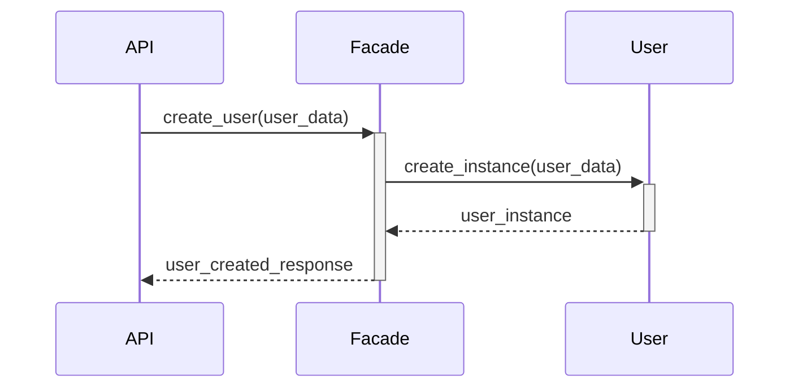

# Implement the User Endpoints

## Context

This task involves setting up the endpoints to handle CRUD operations (Create, Read, Update) for users, while ensuring integration with the Business Logic layer via the Facade pattern. The `DELETE` operation will **not** be implemented for users in this part of the project.

The API interface, return format, and status codes must be clearly defined since it **must follow the standard RESTful API conventions**.

## Objective

In this task, the full implementation for user creation (POST) and retrieval (GET) by ID is provided as a guide. You will be responsible for implementing the retrieval of the list of users (GET /api/v1/users/) and updating user information (PUT /api/v1/users/<user_id>)

1. Set up the `POST`, `GET`, and `PUT` endpoints for managing users.
2. Implement the logic for handling user-related operations in the Business Logic layer.
3. Integrate the Presentation layer (API) and Business Logic layer through the Facade.

## Instructions: Detailed Guide to get you started

### Implement the Business Logic Layer

The Facade methods should be connected to the repository and models implemented in Task 2. Update `services/facade.py` with the following methods:

```python
class HBnBFacade:
    def __init__(self):
        self.user_repo = InMemoryRepository()

    def create_user(self, user_data):
        user = User(**user_data)
        self.user_repo.add(user)
        return user

    def get_user(self, user_id):
        return self.user_repo.get(user_id)

    def get_user_by_email(self, email):
        return self.user_repo.get_by_attribute('email', email)
```

### Implement the User Endpoints in the Presentation Layer (API)

Create the `api/v1/users.py` file and include the following code:

```python
from flask_restx import Namespace, Resource, fields
from app.services import facade

api = Namespace('users', description='User operations')

# Define the user model for input validation and documentation
user_model = api.model('User', {
    'first_name': fields.String(required=True, description='First name of the user'),
    'last_name': fields.String(required=True, description='Last name of the user'),
    'email': fields.String(required=True, description='Email of the user')
})

@api.route('/')
class UserList(Resource):
    @api.expect(user_model, validate=True)
    @api.response(201, 'User successfully created')
    @api.response(400, 'Email already registered')
    @api.response(400, 'Invalid input data')
    def post(self):
        """Register a new user"""
        user_data = api.payload

        # Simulate email uniqueness check (to be replaced by real validation with persistence)
        existing_user = facade.get_user_by_email(user_data['email'])
        if existing_user:
            return {'error': 'Email already registered'}, 400

        new_user = facade.create_user(user_data)
        return {'id': new_user.id, 'first_name': new_user.first_name, 'last_name': new_user.last_name, 'email': new_user.email}, 201
```

- `POST /api/v1/users/`: Registers a new user and performs a check for email uniqueness.

**Explanation:**

- The `POST` endpoint registers a new user and performs a check for email uniqueness.
- If the email is already registered, the API returns a 400 status code with an error message.
- If input data is missing or invalid, a 400 status code is returned with a relevant error message **by the framework** thanks to the `validate=True` parameter.
- The Facade handles all interactions between layers.

### Implementation for User Retrieval by ID (GET /api/v1/users/<user_id>)

Continue in the `api/v1/users.py` file and include this additional code:

```python
@api.route('/<user_id>')
class UserResource(Resource):
    @api.response(200, 'User details retrieved successfully')
    @api.response(404, 'User not found')
    def get(self, user_id):
        """Get user details by ID"""
        user = facade.get_user(user_id)
        if not user:
            return {'error': 'User not found'}, 404
        return {'id': user.id, 'first_name': user.first_name, 'last_name': user.last_name, 'email': user.email}, 200
```

- `GET /api/v1/users/<user_id>`: Retrieves user details by ID.

**Explanation:**

- The `GET` endpoint retrieves user details by ID.
- If the user does not exist, the API returns a 404 status code with an error message.

### Set Up the Namespace in `app/__init__.py`

Before implementing the endpoints, ensure that the users namespace is correctly registered in the application. Update the `app/__init__.py` file as follows:

```python
from flask import Flask
from flask_restx import Api
from app.api.v1.users import api as users_ns

def create_app():
    app = Flask(__name__)
    api = Api(app, version='1.0', title='HBnB API', description='HBnB Application API')

    # Register the users namespace
    api.add_namespace(users_ns, path='/api/v1/users')
    return app
```

This code registers the users namespace, allowing the routes defined in `api/v1/users.py` to be accessible through `/api/v1/users`.

Try running the application to ensure that the user registration and retrieval endpoints are working as expected.

## Input and Output Formats, Status Codes

Once the endpoints are implemented, use tools like Postman or cURL to test each operation.

For example, you can use the following cURL command to create a new user:

```bash
curl -X POST http://localhost:5000/api/v1/users/ \
  -H "Content-Type: application/json" \
  -d '{"first_name": "John", "last_name": "Doe", "email": "john.doe@example.com"}'
```

or use the following cURL command to retrieve a user by ID:

```bash
curl -X GET http://localhost:5000/api/v1/users/<user_id>
```

For each endpoint, you must ensure that the input format, output format, and status codes are consistent and clearly defined:

### Test the Provided Endpoints

Ensure that the provided endpoints are working as expected:

#### Create a User (POST /api/v1/users/)

```http
POST /api/v1/users/
Content-Type: application/json

{
  "first_name": "John",
  "last_name": "Doe",
  "email": "john.doe@example.com"
}
```

Expected Response:

```jsonc
{
  "id": "3fa85f64-5717-4562-b3fc-2c963f66afa6",
  "first_name": "John",
  "last_name": "Doe",
  "email": "john.doe@example.com"
}

// 201 Created
```

Possible Status Codes:

- 201 Created: When the user is successfully created.
- 400 Bad Request: If the email is already registered or input data is invalid.

#### Retrieve a User by ID (GET /api/v1/users/<user_id>)

```http
GET /api/v1/users/<user_id>
Content-Type: application/json
```

Expected Response:

```jsonc
{
  "id": "3fa85f64-5717-4562-b3fc-2c963f66afa6",
  "first_name": "John",
  "last_name": "Doe",
  "email": "john.doe@x.com"
}

// 200 OK
```

Possible Status Codes:

- `200 OK`: When the user is successfully retrieved.
- `404 Not Found`: If the user does not exist.

> Now you should have working services to create and retrieve users.

Complete the task by finishing the other endpoints for User management.

### Testing your endpoints

Ensure that your endpoints are working as expected. Here are some examples:

#### Retrieve a List of Users (GET /api/v1/users/)

```http
GET /api/v1/users/
Content-Type: application/json
```

Expected Response:

```jsonc
[
  {
    "id": "3fa85f64-5717-4562-b3fc-2c963f66afa6",
    "first_name": "John",
    "last_name": "Doe",
    "email": "john.doe@example.com"
  },
  ...
]

// 200 OK
```

Possible Status Codes:

- `200 OK`: When the list of users is successfully retrieved.

#### Update a User (PUT /api/v1/users/<user_id>)

```http
PUT /api/v1/users/<user_id>
Content-Type: application/json

{
  "first_name": "Jane",
  "last_name": "Doe",
  "email": "jane.doe@example.com"
}
```

Expected Response:

```jsonc
{
  "id": "3fa85f64-5717-4562-b3fc-2c963f66afa6",
  "first_name": "Jane",
  "last_name": "Doe",
  "email": "jane.doe@example.com"
}

// 200 OK
```

Possible Status Codes:

- 200 OK: When the user is successfully updated.
- 404 Not Found: If the user does not exist.
- 400 Bad Request: If input data is invalid.

## Sequence Diagram: Visualizing the Flow of User Registration



This diagram shows the interaction between the API, Facade, and Business Logic layer when registering a new user.

## Expected Outcome

By the end of this task, you should have fully implemented the core user management endpoints, including the ability to create, read, and update users. The provided implementation guide for the user registration endpoint should serve as a model for implementing the remaining user endpoints as well as endpoints for other entities (e.g., Place, Review, Amenity).

The functionality should be documented and tested, ensuring that all user-related operations are handled smoothly within the HBnB application.

## Resources

1. [**Flask-RESTx Documentation**](https://flask-restx.readthedocs.io/)
2. [**Testing REST APIs with cURL**](https://everything.curl.dev/)
3. [**Designing RESTful APIs**](https://restfulapi.net/)
