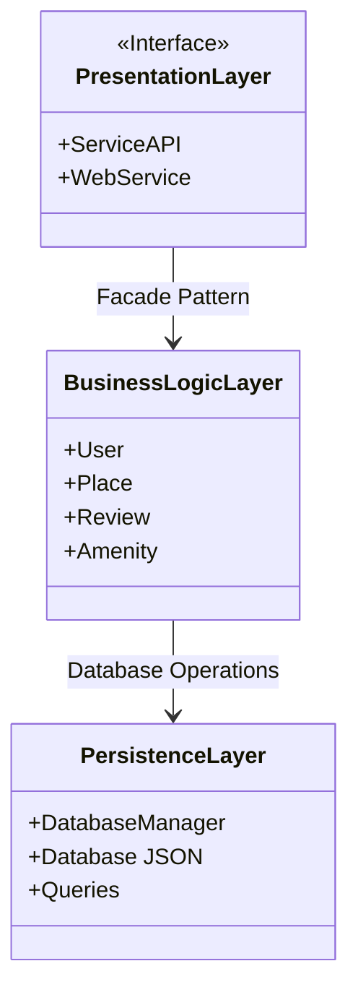
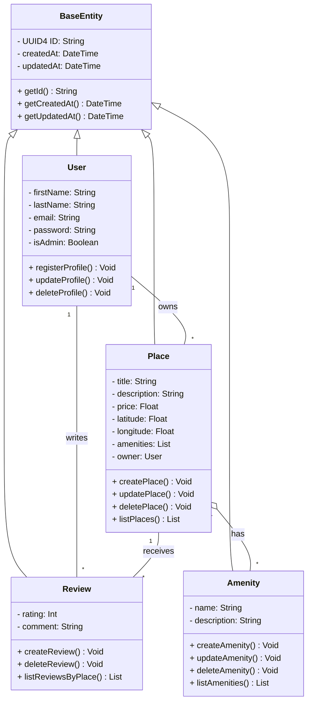
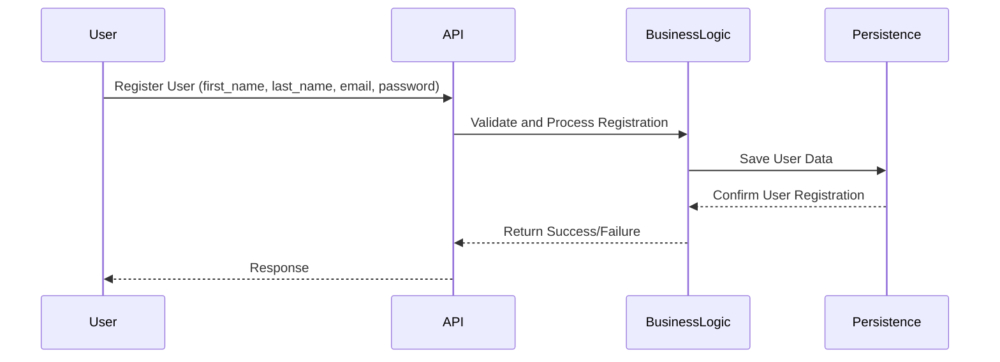
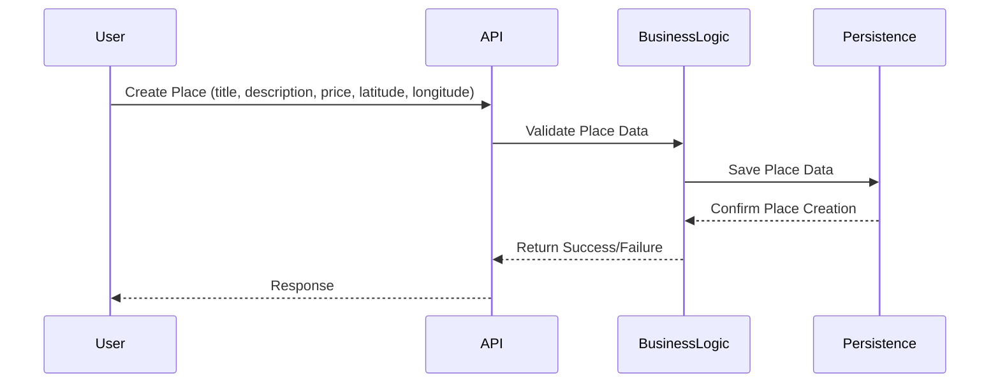
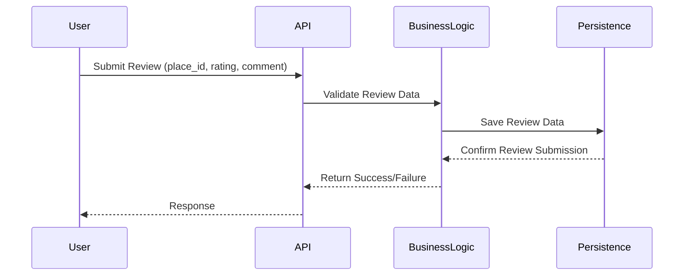
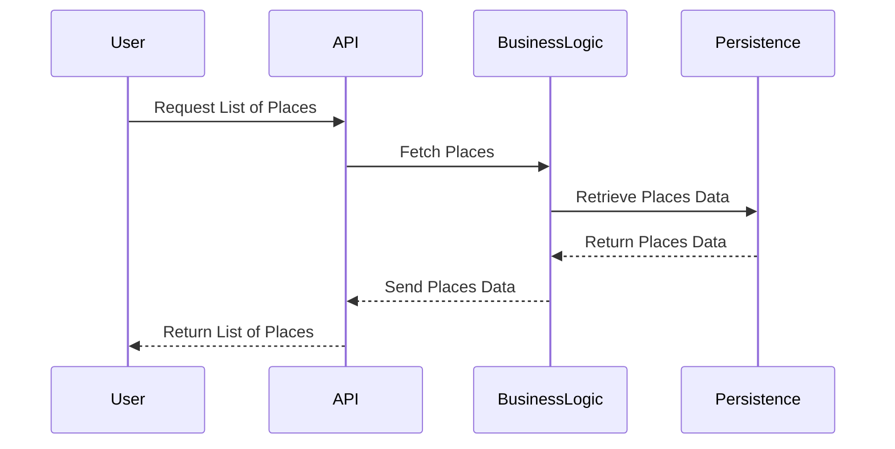

# HBnB Evolution Technical Documentation

Table of Contents
1) Introduction
2) High-Level Architecture
3) Business Logic Layer
4) API Interaction Flow
5) Conclusion

## 1) Introduction
### Overview of the Project
HBnB Evolution is a simplified version of an AirBnB-like application designed to facilitate user interactions around property listings, user reviews, and amenities. This document serves as a foundation for understanding the architecture, business logic, and API interactions within the application.

### Purpose of the Document
The purpose of this document is to provide a clear and detailed reference that outlines the application's structure, the relationships between various components, and the flow of information through the system. This will serve as a guide for the implementation phases of the HBnB Evolution application.

## 2) High-Level Architecture
### High-Level Package Diagram
The following diagram illustrates the three-layer architecture of the HBnB Evolution application. It demonstrates the interaction between the Presentation Layer, Business Logic Layer, and Persistence Layer using the facade pattern.

#### Explanatory Notes:
Presentation Layer: This layer encompasses all services and API endpoints that interact with users, facilitating user registration, property management, and review submissions.
Business Logic Layer: It includes the core models representing the entities (User, Place, Review, Amenity) and their respective business logic.
Persistence Layer: Responsible for data storage and retrieval, this layer interacts directly with the database to perform CRUD operations.
Facade Pattern: The facade pattern simplifies communication between the layers by providing a unified interface through which the Presentation Layer interacts with the Business Logic Layer.

#### Purpose:
To illustrate the high-level structure of the application by showing how different layers interact and the relationships between them.

#### Key Components:
Presentation Layer: Contains the interface for interacting with users, including ServiceAPI and WebService.
Business Logic Layer: Manages the core functionality of the application, including classes like User, Place, Review, and Amenity.
Persistence Layer: Handles data storage and retrieval with DatabaseManager, Database JSON, and various queries.

#### Design Decisions:
The use of the Facade Pattern between the Presentation Layer and the Business Logic Layer simplifies the interface and hides complexity.
The direct interaction between the Business Logic Layer and the Persistence Layer is essential for clean separation of concerns, allowing business rules to operate independently of data storage.

#### Fit into Overall Architecture:
This diagram encapsulates the three-layer architecture of the application, defining clear boundaries and responsibilities for each layer. It sets the foundation for understanding how the application processes user requests and manages data.

## 3) Business Logic Layer
### Detailed Class Diagram
The following diagram outlines the classes within the Business Logic layer, detailing the attributes, methods, and relationships between the User, Place, Review, and Amenity entities.

#### Explanatory Notes:
User: Represents the application user with attributes for identification and methods for registration, updating profiles, and deletion.
Place: Represents a property listing, including methods for creation, updating, and listing of properties.
Review: Allows users to submit reviews for places they have visited, associated with both a user and a place.
Amenity: Represents amenities that can be associated with places, including methods for managing amenities.

#### Relationships:
A user can own multiple places (1 to many).
A place can have multiple reviews and amenities (1 to many).

#### Purpose:
To define the structure of key classes in the application, including their attributes and methods, and to illustrate the relationships between them.

#### Key Components:
User: Manages user-related data and functionality.
Place: Represents locations that can be listed, reviewed, and interacted with.
Review: Handles the reviews made by users on places.
Amenity: Describes additional features associated with a place.

#### Design Decisions:
Each class encapsulates its data and provides methods for interacting with that data, promoting encapsulation and abstraction.
The use of associations (e.g., User owns Place, Place receives Review) establishes clear relationships, helping to model real-world interactions.

#### Fit into Overall Architecture:
This diagram forms the core of the Business Logic Layer, showing how entities interact and are structured. It serves as a blueprint for implementation and guides the development of the application’s functionalities.

## 4) API Interaction Flow
### Sequence Diagrams for API Calls
The following sequence diagrams depict the flow of interactions for four different API calls, illustrating how information moves between the layers.

#### 1. User Registration

##### Explanatory Notes:
Overview: This diagram illustrates the sequence of events that occur when a user registers in the application. It outlines the interactions between the user, API, business logic, and persistence layers.

Step-by-Step Explanation:
1.User Action: The user initiates the registration process by sending a request to the API to create a new user.
2.API Processing: The API receives the request and forwards the user data to the Business Logic layer for validation.
3.Data Validation: The Business Logic layer validates the user data to ensure that it meets all required criteria (e.g., format, uniqueness).
4.Data Persistence: Upon successful validation, the Business Logic layer instructs the Persistence layer to save the new user information to the database.
5.Success Confirmation: The Persistence layer confirms the successful save operation and returns a success message to the Business Logic layer.
6.Return to API: The Business Logic layer then sends back the user information to the API.
7.Final Response: Finally, the API returns a response to the user, confirming that the registration was successful.

Significance: This diagram demonstrates the process flow for user registration, emphasizing data validation and persistence, and highlights the interaction between different layers of the application.

##### Purpose:
To outline the process of user registration, illustrating the flow of information and actions between the user and the system.

##### Key Components:
User: The actor initiating the registration.
API: The interface that processes user requests.
BusinessLogic: Validates and processes business rules for registration.
Persistence: Handles data storage.

##### Design Decisions:
The validation step ensures that only correctly formatted and complete data is saved, enhancing data integrity.
Returning user info after successful creation allows for immediate feedback to the user.

##### Fit into Overall Architecture:
his diagram shows how the Presentation Layer interacts with the Business Logic Layer and the Persistence Layer to fulfill user requests, emphasizing the application’s responsiveness and data handling.

#### 2. Place Creation

##### Explanatory Notes:
Overview: This diagram depicts the process of creating a new place within the application, showing the interactions necessary to handle the request.

Step-by-Step Explanation:
1.User Action: The user sends a request to the API to create a new place.
2.API Processing: The API forwards the request to the Business Logic layer for processing.
3.Data Validation: The Business Logic layer validates the place data (e.g., ensuring required fields are filled and values are appropriate).
4.Data Persistence: After validation, the Business Logic layer instructs the Persistence layer to save the new place information.
5.Success Confirmation: The Persistence layer confirms the operation's success, returning a message to the Business Logic layer.
6.Return to API: The Business Logic layer sends the place information back to the API.
7.Final Response: The API responds to the user, confirming the successful creation of the place.

Significance: This diagram illustrates the workflow for creating places in the application, highlighting the importance of validation and interaction among the layers involved.

##### Purpose:
To illustrate the steps involved in creating a new place, detailing the interactions among system components.

##### Key Components:
Same as above.

##### Design Decisions:
Similar to the user registration process, this sequence emphasizes validation and persistence of place data to maintain accuracy and reliability.

##### Fit into Overall Architecture:
It highlights the role of the Business Logic Layer in managing place creation and how it interfaces with the API and data storage.

#### 3. Review Submission

##### Explanatory Notes:
Overview: This diagram shows the steps involved when a user submits a review for a place, detailing how the request is processed.

Step-by-Step Explanation:
1.User Action: The user initiates the review submission process by sending a request to the API.
2.API Processing: The API receives the request and forwards it to the Business Logic layer.
3.Data Validation: The Business Logic layer validates the review data to ensure it meets the necessary criteria (e.g., rating is within an acceptable range).
4.Data Persistence: Upon successful validation, the Business Logic layer instructs the Persistence layer to save the review.
5.Success Confirmation: The Persistence layer confirms the save operation and returns a success message to the Business Logic layer.
6.Return to API: The Business Logic layer sends the review information back to the API.
7.Final Response: Finally, the API returns a confirmation message to the user, indicating that the review has been successfully added.

Significance: This diagram emphasizes the importance of validating user input and shows how user interactions with reviews are handled within the application's architecture.

##### Purpose:
To demonstrate how users submit reviews and how these are processed within the application.

##### Key Components:
Same as above.

##### Design Decisions:
The sequence emphasizes data validation and storage for reviews, ensuring that only valid entries are accepted.

##### Fit into Overall Architecture:
This diagram is essential for understanding user interactions with reviews and illustrates the flow from the user through the system to data storage.

#### 4. Fetching a List of Places

##### Explanatory Notes:
Overview: This diagram illustrates the process of fetching a list of places, demonstrating the interactions required to retrieve data from the application.

Step-by-Step Explanation:
1.User Action: The user requests a list of places through the API.
2.API Processing: The API forwards the request to the Business Logic layer for validation and processing.
3.Validation Check: The Business Logic layer performs any necessary validation to ensure that the request is legitimate (e.g., checking user permissions).
4.Data Retrieval: The Business Logic layer then instructs the Persistence layer to retrieve the list of places from the database.
5.Return Data: The Persistence layer returns the requested list of places to the Business Logic layer.
6.Return to API: The Business Logic layer sends the list back to the API.
7.Final Response: The API then returns the list of places to the user.

Significance: This diagram highlights the process for retrieving data in the application, showing how requests are handled and data is managed across the layers, ensuring a smooth user experience.

##### Purpose:
To show the process of fetching a list of places, highlighting the interactions necessary to retrieve data.

##### Key Components:
Same as above.

##### Design Decisions:
The validation step ensures that the request is legitimate, while retrieval from the persistence layer showcases the separation of concerns.

##### Fit into Overall Architecture:
This diagram illustrates the retrieval operations of the Business Logic Layer and its communication with the Presentation Layer, emphasizing the application’s ability to respond to user queries effectively.

#### Explanatory Notes all sequence diagram:
Each sequence diagram illustrates the step-by-step interactions for specific API calls.
The flow shows how data is validated, processed, and stored, as well as how responses are generated and sent back to the user.

## 5) Conclusion
This technical documentation provides a foundational understanding of the HBnB Evolution application's architecture, business logic, and API interactions. The diagrams and explanations included serve as a comprehensive reference for the implementation phases, ensuring that all stakeholders have a clear vision of the system's design and functionality.
